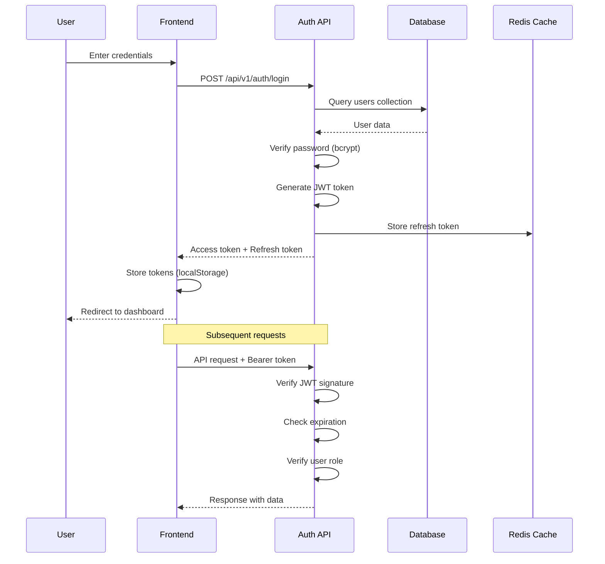
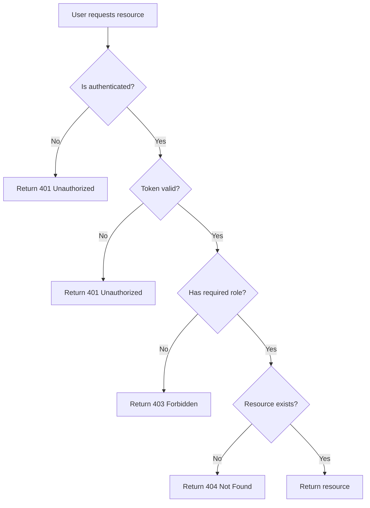

# Authentication & Authorization Implementation Plan
# Role-Based Access Control for Card Template System

**Version:** 1.0
**Created:** January 12, 2026
**Status:** Planning Phase
**Estimated Effort:** 50-60 hours (2-3 weeks, 2 developers)

---

## Table of Contents

1. [Executive Summary](#1-executive-summary)
2. [Requirements & User Roles](#2-requirements--user-roles)
3. [Architecture & Design](#3-architecture--design)
4. [Database Schema](#4-database-schema)
5. [Implementation Phases](#5-implementation-phases)
6. [API Specification](#6-api-specification)
7. [Frontend Components](#7-frontend-components)
8. [Testing Strategy](#8-testing-strategy)
9. [Security Requirements](#9-security-requirements)
10. [Integration with Visual Editor](#10-integration-with-visual-editor)

---

## 1. Executive Summary

### 1.1 Problem Statement

The Content Template System currently has no authentication or access control. All users can access all features, which creates problems:

- ❌ Anyone can edit cards (no content protection)
- ❌ No user tracking for changes (no accountability)
- ❌ No demo mode control (can't hide work-in-progress cards)
- ❌ No admin capabilities (can't manage users or content)

### 1.2 Proposed Solution

Implement a **three-tier role-based access control (RBAC)** system:

| Role | Login Required | Capabilities |
|------|----------------|--------------|
| **Guest** | No | View published cards, read-only access |
| **Viewer** | Yes | Guest access + configure card visibility for demos |
| **Admin** | Yes | Viewer access + edit cards, manage users, import/export |

### 1.3 Key Features

✅ **JWT-based authentication** - Stateless, secure, scalable
✅ **Role-based authorization** - Granular permission control
✅ **User management** - Admin can create/edit/delete users
✅ **Password security** - Bcrypt hashing, password policies
✅ **Session management** - Auto-logout, remember me, token refresh
✅ **Demo mode** - Viewers can configure card visibility
✅ **Audit logging** - Track all user actions

### 1.4 Benefits

✅ **Content Protection**: Only admins can modify cards
✅ **Accountability**: Track who made what changes
✅ **Demo Preparation**: Viewers can customize card visibility
✅ **Security**: Industry-standard authentication practices
✅ **Compliance**: Ready for enterprise deployment

---

## 2. Requirements & User Roles

### 2.1 User Stories

**US-1: Guest User - Browse Cards**
> As a guest user, I want to view published cards without logging in
> so that I can explore the documentation quickly.

**Acceptance Criteria:**
- [ ] Can access homepage without login
- [ ] Can view all published cards
- [ ] Can navigate card pages
- [ ] Cannot see draft/hidden cards
- [ ] Cannot edit any content
- [ ] See "Login" button in header

**US-2: Viewer - Configure Demo Mode**
> As a viewer, I want to customize which cards are visible
> so that I can prepare tailored demos for different audiences.

**Acceptance Criteria:**
- [ ] Can login with email/password
- [ ] Can access "Demo Settings" page
- [ ] Can show/hide individual cards
- [ ] Can save visibility preferences
- [ ] Can preview demo view
- [ ] Settings persist across sessions

**US-3: Admin - Edit Cards**
> As an admin, I want to access the visual editor
> so that I can create and modify documentation cards.

**Acceptance Criteria:**
- [ ] Can login with admin credentials
- [ ] Can access Visual Editor
- [ ] Can create new cards
- [ ] Can edit existing cards
- [ ] Can delete cards
- [ ] Can import/export cards
- [ ] All changes are logged with username

**US-4: Admin - Manage Users**
> As an admin, I want to manage user accounts
> so that I can control who has access to the system.

**Acceptance Criteria:**
- [ ] Can access User Management page
- [ ] Can create new users (email, password, role)
- [ ] Can edit user details
- [ ] Can reset user passwords
- [ ] Can deactivate/activate users
- [ ] Can delete users
- [ ] Can view user activity logs

**US-5: All Users - Secure Authentication**
> As any user, I want secure login and session management
> so that my account is protected.

**Acceptance Criteria:**
- [ ] Password is masked during input
- [ ] Password must meet security requirements
- [ ] Session expires after inactivity (30 min)
- [ ] Can logout manually
- [ ] Token refreshes automatically
- [ ] Forced logout on password change

### 2.2 Role Permissions Matrix

| Feature | Guest | Viewer | Admin |
|---------|-------|--------|-------|
| **Content Access** |
| View published cards | ✅ | ✅ | ✅ |
| View draft cards | ❌ | ❌ | ✅ |
| View hidden cards | ❌ | ❌ | ✅ |
| Search cards | ✅ | ✅ | ✅ |
| Export card (public) | ✅ | ✅ | ✅ |
| **Card Management** |
| Create cards | ❌ | ❌ | ✅ |
| Edit cards | ❌ | ❌ | ✅ |
| Delete cards | ❌ | ❌ | ✅ |
| Publish/unpublish cards | ❌ | ❌ | ✅ |
| Import cards | ❌ | ❌ | ✅ |
| Export card (all data) | ❌ | ❌ | ✅ |
| **Visual Editor** |
| Access editor | ❌ | ❌ | ✅ |
| Edit YAML | ❌ | ❌ | ✅ |
| Preview changes | ❌ | ❌ | ✅ |
| Save changes | ❌ | ❌ | ✅ |
| **Demo Configuration** |
| View demo settings | ❌ | ✅ | ✅ |
| Edit demo settings | ❌ | ✅ | ✅ |
| Configure card visibility | ❌ | ✅ | ✅ |
| Save visibility presets | ❌ | ✅ | ✅ |
| **User Management** |
| View user list | ❌ | ❌ | ✅ |
| Create users | ❌ | ❌ | ✅ |
| Edit users | ❌ | ❌ | ✅ |
| Delete users | ❌ | ❌ | ✅ |
| Reset passwords | ❌ | ❌ | ✅ |
| View audit logs | ❌ | ❌ | ✅ |

### 2.3 Password Policy

**Requirements:**
- Minimum 8 characters
- At least 1 uppercase letter
- At least 1 lowercase letter
- At least 1 number
- At least 1 special character (!@#$%^&*)
- Cannot be common passwords (check against dictionary)
- Cannot be same as email
- Cannot be same as username

**Password Reset:**
- Admin can reset any user's password
- User receives email with temporary password
- Must change password on first login after reset
- Temporary password expires in 24 hours

---

## 3. Architecture & Design

### 3.1 Authentication Flow



### 3.2 Authorization Flow



### 3.3 Component Architecture

```
┌─────────────────────────────────────────────────────────┐
│                    Frontend Layer                        │
│  ┌──────────────┐  ┌──────────────┐  ┌──────────────┐  │
│  │ Login Form   │  │ User Mgmt UI │  │ Demo Settings│  │
│  └──────────────┘  └──────────────┘  └──────────────┘  │
│                                                          │
│  ┌──────────────────────────────────────────────────┐  │
│  │         AuthContext (React Context)              │  │
│  │  - Current user state                            │  │
│  │  - Login/logout methods                          │  │
│  │  - Permission checks                             │  │
│  └──────────────────────────────────────────────────┘  │
└─────────────────────────────────────────────────────────┘
                            │
                            ↓ (API Requests)
┌─────────────────────────────────────────────────────────┐
│                    API Layer (FastAPI)                   │
│  ┌──────────────┐  ┌──────────────┐  ┌──────────────┐  │
│  │ Auth Router  │  │ User Router  │  │ Demo Router  │  │
│  └──────────────┘  └──────────────┘  └──────────────┘  │
│                                                          │
│  ┌──────────────────────────────────────────────────┐  │
│  │      Auth Middleware (JWT Verification)          │  │
│  │  - Verify token signature                        │  │
│  │  - Check expiration                              │  │
│  │  - Extract user & roles                          │  │
│  └──────────────────────────────────────────────────┘  │
└─────────────────────────────────────────────────────────┘
                            │
                            ↓ (Database Queries)
┌─────────────────────────────────────────────────────────┐
│                 Service Layer                            │
│  ┌──────────────┐  ┌──────────────┐  ┌──────────────┐  │
│  │ AuthService  │  │ UserService  │  │ DemoService  │  │
│  └──────────────┘  └──────────────┘  └──────────────┘  │
└─────────────────────────────────────────────────────────┘
                            │
                            ↓
┌─────────────────────────────────────────────────────────┐
│              Database Layer (MongoDB + Redis)            │
│  ┌──────────────┐  ┌──────────────┐  ┌──────────────┐  │
│  │ users        │  │ sessions     │  │ demo_configs │  │
│  │ collection   │  │ (Redis)      │  │ collection   │  │
│  └──────────────┘  └──────────────┘  └──────────────┘  │
└─────────────────────────────────────────────────────────┘
```

### 3.4 Security Layers

```
┌─────────────────────────────────────────┐
│  1. Transport Layer (HTTPS/TLS)         │  ← Encrypted communication
├─────────────────────────────────────────┤
│  2. Authentication (JWT)                │  ← Who are you?
├─────────────────────────────────────────┤
│  3. Authorization (RBAC)                │  ← What can you do?
├─────────────────────────────────────────┤
│  4. Input Validation                    │  ← Is your input safe?
├─────────────────────────────────────────┤
│  5. Rate Limiting                       │  ← Are you abusing the API?
├─────────────────────────────────────────┤
│  6. Audit Logging                       │  ← Track all actions
└─────────────────────────────────────────┘
```

---

## 4. Database Schema

### 4.1 Users Collection

```typescript
interface UserDocument {
  _id: ObjectId;
  user_id: string;                    // Unique identifier (UUID)
  email: string;                      // Unique email address
  username: string;                   // Display name
  password_hash: string;              // Bcrypt hash (never store plain text!)
  role: 'guest' | 'viewer' | 'admin'; // User role

  // Profile
  profile: {
    first_name: string;
    last_name: string;
    avatar_url?: string;
    timezone?: string;
  };

  // Security
  is_active: boolean;                 // Account active/disabled
  email_verified: boolean;            // Email verification status
  must_change_password: boolean;      // Force password change on next login
  password_changed_at?: Date;         // Last password change timestamp
  failed_login_attempts: number;      // Track failed logins
  locked_until?: Date;                // Account lockout timestamp

  // Timestamps
  created_at: Date;
  updated_at: Date;
  last_login_at?: Date;

  // Metadata
  created_by: string;                 // User ID who created this account
  updated_by: string;                 // User ID who last updated
}
```

**Indexes:**
- `email`: Unique index
- `user_id`: Unique index
- `role`: Non-unique index for filtering
- `is_active`: Non-unique index for filtering
- `created_at`: Index for sorting

**Sample Document:**

```json
{
  "_id": "65a1b2c3d4e5f6g7h8i9j0k1",
  "user_id": "usr_a1b2c3d4e5",
  "email": "admin@example.com",
  "username": "Admin User",
  "password_hash": "$2b$12$KIXxBqz.../hashed_password",
  "role": "admin",
  "profile": {
    "first_name": "John",
    "last_name": "Doe",
    "avatar_url": "https://example.com/avatars/john.jpg",
    "timezone": "America/New_York"
  },
  "is_active": true,
  "email_verified": true,
  "must_change_password": false,
  "failed_login_attempts": 0,
  "created_at": "2026-01-01T00:00:00Z",
  "updated_at": "2026-01-12T10:30:00Z",
  "last_login_at": "2026-01-12T08:15:00Z",
  "created_by": "system",
  "updated_by": "usr_a1b2c3d4e5"
}
```

### 4.2 Sessions Collection (Redis)

```typescript
interface SessionData {
  session_id: string;                 // UUID
  user_id: string;                    // Reference to users.user_id
  refresh_token: string;              // JWT refresh token
  access_token_jti: string;           // JWT ID for revocation
  ip_address: string;                 // Client IP
  user_agent: string;                 // Browser/device info
  created_at: Date;
  expires_at: Date;
  last_activity_at: Date;
}
```

**Redis Key Pattern:** `session:{session_id}`
**TTL:** 30 days (refreshable)

### 4.3 Demo Configurations Collection

```typescript
interface DemoConfigDocument {
  _id: ObjectId;
  config_id: string;                  // Unique identifier
  user_id: string;                    // Reference to users.user_id
  name: string;                       // Config name (e.g., "Sales Demo", "Technical Demo")
  description: string;

  // Card visibility settings
  card_visibility: {
    [card_id: string]: {
      visible: boolean;
      order?: number;                 // Custom ordering
      notes?: string;                 // Internal notes
    }
  };

  // Global settings
  settings: {
    show_drafts: boolean;
    show_categories: string[];        // Which categories to show
    default_theme?: string;           // Override theme
  };

  is_active: boolean;                 // Currently active config
  is_default: boolean;                // Default config for user

  created_at: Date;
  updated_at: Date;
}
```

**Indexes:**
- `config_id`: Unique index
- `user_id`: Non-unique index
- `user_id, is_active`: Compound index for active config lookup

**Sample Document:**

```json
{
  "_id": "65a1b2c3d4e5f6g7h8i9j0k2",
  "config_id": "cfg_x1y2z3a4b5",
  "user_id": "usr_viewer123",
  "name": "Sales Demo - Q1 2026",
  "description": "Configuration for Q1 sales presentations",
  "card_visibility": {
    "observability": {
      "visible": true,
      "order": 1,
      "notes": "Great for infrastructure teams"
    },
    "security": {
      "visible": true,
      "order": 2
    },
    "new-feature": {
      "visible": false,
      "notes": "Not ready for external demos"
    }
  },
  "settings": {
    "show_drafts": false,
    "show_categories": ["technical", "business"],
    "default_theme": "light"
  },
  "is_active": true,
  "is_default": false,
  "created_at": "2026-01-10T00:00:00Z",
  "updated_at": "2026-01-12T14:30:00Z"
}
```

### 4.4 Audit Logs Collection

```typescript
interface AuditLogDocument {
  _id: ObjectId;
  log_id: string;                     // Unique identifier
  timestamp: Date;

  // Actor
  user_id: string;                    // Who performed the action
  user_email: string;                 // Denormalized for reporting
  user_role: string;

  // Action
  action: string;                     // e.g., "login", "create_card", "delete_user"
  resource_type: string;              // e.g., "card", "user", "demo_config"
  resource_id?: string;               // ID of affected resource

  // Context
  ip_address: string;
  user_agent: string;
  endpoint: string;                   // API endpoint
  method: string;                     // HTTP method

  // Details
  changes?: {                         // For update actions
    before: object;
    after: object;
  };
  metadata?: object;                  // Additional context

  // Result
  success: boolean;
  error_message?: string;
}
```

**Indexes:**
- `timestamp`: Index for time-based queries
- `user_id`: Non-unique index
- `action`: Non-unique index
- `resource_type, resource_id`: Compound index

**Sample Document:**

```json
{
  "_id": "65a1b2c3d4e5f6g7h8i9j0k3",
  "log_id": "log_p1q2r3s4t5",
  "timestamp": "2026-01-12T10:45:23Z",
  "user_id": "usr_admin123",
  "user_email": "admin@example.com",
  "user_role": "admin",
  "action": "update_card",
  "resource_type": "card",
  "resource_id": "observability",
  "ip_address": "192.168.1.100",
  "user_agent": "Mozilla/5.0...",
  "endpoint": "/api/v1/cards/observability",
  "method": "PUT",
  "changes": {
    "before": {"published": false},
    "after": {"published": true}
  },
  "metadata": {
    "version_before": 3,
    "version_after": 4
  },
  "success": true
}
```

---

## 5. Implementation Phases

### Phase 1: Backend Authentication Foundation (Week 1) - 20 hours

**Goal:** Implement core authentication system with JWT

#### Tasks

**1.1 User Model & Database** (6 hours)

**TDD Approach:**
```python
# STEP 1: Write tests FIRST (Red)
# test_user_model.py

def test_user_model_validates_email_format():
    """Test that invalid email raises validation error."""
    with pytest.raises(ValidationError):
        UserDocument(
            email="invalid-email",  # Missing @
            username="Test User",
            password_hash="$2b$12$...",
            role="viewer"
        )

def test_user_model_requires_strong_password_hash():
    """Test that password hash must be bcrypt format."""
    with pytest.raises(ValidationError):
        UserDocument(
            email="test@example.com",
            username="Test User",
            password_hash="plaintext",  # Not a hash!
            role="viewer"
        )

def test_user_model_defaults_to_active():
    """Test that new users are active by default."""
    user = UserDocument(
        email="test@example.com",
        username="Test User",
        password_hash="$2b$12$...",
        role="viewer"
    )
    assert user.is_active == True

# STEP 2: Run tests - they should FAIL (Red)
# STEP 3: Implement minimal code to pass (Green)
# STEP 4: Refactor while keeping tests green
```

**Implementation Tasks:**
- [ ] Create `backend/app/models/user.py`
- [ ] Define `UserDocument` Pydantic model
- [ ] Add email validation (regex pattern)
- [ ] Add password hash validation (bcrypt format)
- [ ] Add role enum validation
- [ ] Write 20+ unit tests (TDD)
- [ ] Create MongoDB indexes

**1.2 Password Security Service** (6 hours)

**TDD Approach:**
```python
# test_password_service.py

def test_hash_password_returns_bcrypt_hash():
    """Test password hashing."""
    password = "MySecureP@ssw0rd"
    hash = PasswordService.hash_password(password)

    assert hash.startswith("$2b$")
    assert len(hash) == 60  # Bcrypt hash length
    assert hash != password  # Not plaintext

def test_verify_password_with_correct_password():
    """Test password verification succeeds with correct password."""
    password = "MySecureP@ssw0rd"
    hash = PasswordService.hash_password(password)

    assert PasswordService.verify_password(password, hash) == True

def test_verify_password_with_wrong_password():
    """Test password verification fails with wrong password."""
    password = "MySecureP@ssw0rd"
    hash = PasswordService.hash_password(password)

    assert PasswordService.verify_password("WrongPassword", hash) == False

def test_validate_password_strength_requires_uppercase():
    """Test password strength validation."""
    with pytest.raises(WeakPasswordError):
        PasswordService.validate_password_strength("alllowercase1!")

def test_validate_password_strength_requires_number():
    """Test password strength validation."""
    with pytest.raises(WeakPasswordError):
        PasswordService.validate_password_strength("NoNumbers!")
```

**Implementation Tasks:**
- [ ] Create `backend/app/services/password_service.py`
- [ ] Implement `hash_password()` using bcrypt
- [ ] Implement `verify_password()`
- [ ] Implement `validate_password_strength()`
- [ ] Check against common password list
- [ ] Write 15+ unit tests (TDD)

**1.3 JWT Token Service** (8 hours)

**TDD Approach:**
```python
# test_jwt_service.py

def test_create_access_token():
    """Test access token creation."""
    payload = {"user_id": "usr_123", "role": "admin"}
    token = JWTService.create_access_token(payload)

    assert isinstance(token, str)
    assert len(token) > 0
    # Verify it's a valid JWT format (header.payload.signature)
    assert token.count('.') == 2

def test_verify_valid_token():
    """Test token verification with valid token."""
    payload = {"user_id": "usr_123", "role": "admin"}
    token = JWTService.create_access_token(payload)

    decoded = JWTService.verify_token(token)
    assert decoded["user_id"] == "usr_123"
    assert decoded["role"] == "admin"
    assert "exp" in decoded  # Expiration timestamp

def test_verify_expired_token():
    """Test that expired tokens are rejected."""
    # Create token that expires immediately
    payload = {"user_id": "usr_123"}
    token = JWTService.create_access_token(payload, expires_delta=timedelta(seconds=-1))

    with pytest.raises(TokenExpiredError):
        JWTService.verify_token(token)

def test_verify_tampered_token():
    """Test that tampered tokens are rejected."""
    payload = {"user_id": "usr_123"}
    token = JWTService.create_access_token(payload)

    # Tamper with token
    tampered = token[:-5] + "XXXXX"

    with pytest.raises(InvalidTokenError):
        JWTService.verify_token(tampered)

def test_refresh_token_has_longer_expiry():
    """Test refresh tokens have longer TTL than access tokens."""
    access_token = JWTService.create_access_token({"user_id": "usr_123"})
    refresh_token = JWTService.create_refresh_token({"user_id": "usr_123"})

    access_exp = JWTService.verify_token(access_token)["exp"]
    refresh_exp = JWTService.verify_token(refresh_token)["exp"]

    assert refresh_exp > access_exp
```

**Implementation Tasks:**
- [ ] Create `backend/app/services/jwt_service.py`
- [ ] Implement `create_access_token()` (15-min expiry)
- [ ] Implement `create_refresh_token()` (30-day expiry)
- [ ] Implement `verify_token()`
- [ ] Implement `refresh_access_token()`
- [ ] Add JWT signing secret from environment
- [ ] Write 20+ unit tests (TDD)

**Acceptance Criteria:**
- [ ] All models pass validation tests
- [ ] Password hashing is secure (bcrypt, cost=12)
- [ ] JWT tokens work correctly
- [ ] 55+ tests passing
- [ ] Code coverage > 90%

---

### Phase 2: Authentication API & Middleware (Week 1-2) - 16 hours

**Goal:** Implement login/logout endpoints and auth middleware

#### Tasks

**2.1 Authentication Endpoints** (8 hours)

**TDD Approach:**
```python
# test_auth_api.py (Integration tests)

@pytest.mark.asyncio
async def test_login_with_valid_credentials(client, test_user):
    """Test login with correct email/password."""
    response = await client.post("/api/v1/auth/login", json={
        "email": "test@example.com",
        "password": "SecureP@ssw0rd123"
    })

    assert response.status_code == 200
    data = response.json()
    assert "access_token" in data
    assert "refresh_token" in data
    assert "user" in data
    assert data["user"]["email"] == "test@example.com"
    assert data["user"]["role"] == "viewer"
    # Password should never be returned!
    assert "password" not in data["user"]
    assert "password_hash" not in data["user"]

@pytest.mark.asyncio
async def test_login_with_wrong_password(client, test_user):
    """Test login fails with wrong password."""
    response = await client.post("/api/v1/auth/login", json={
        "email": "test@example.com",
        "password": "WrongPassword"
    })

    assert response.status_code == 401
    data = response.json()
    assert data["detail"] == "Invalid email or password"
    # Should not reveal which field is wrong (security)

@pytest.mark.asyncio
async def test_login_increments_failed_attempts(client, test_user):
    """Test failed login attempts are tracked."""
    # Attempt login 3 times with wrong password
    for i in range(3):
        await client.post("/api/v1/auth/login", json={
            "email": "test@example.com",
            "password": "WrongPassword"
        })

    # Check user record
    user = await get_user_by_email("test@example.com")
    assert user.failed_login_attempts == 3

@pytest.mark.asyncio
async def test_login_locks_account_after_5_failures(client, test_user):
    """Test account locks after 5 failed attempts."""
    # Attempt login 5 times with wrong password
    for i in range(5):
        await client.post("/api/v1/auth/login", json={
            "email": "test@example.com",
            "password": "WrongPassword"
        })

    # 6th attempt should be blocked
    response = await client.post("/api/v1/auth/login", json={
        "email": "test@example.com",
        "password": "SecureP@ssw0rd123"  # Correct password!
    })

    assert response.status_code == 423  # Locked
    data = response.json()
    assert "locked" in data["detail"].lower()

@pytest.mark.asyncio
async def test_logout_invalidates_token(client, authenticated_client):
    """Test logout invalidates the access token."""
    # Logout
    response = await authenticated_client.post("/api/v1/auth/logout")
    assert response.status_code == 200

    # Try to use the same token
    response = await authenticated_client.get("/api/v1/users/me")
    assert response.status_code == 401  # Unauthorized
```

**Implementation Tasks:**
- [ ] Create `backend/app/api/auth.py`
- [ ] POST /auth/login - Authenticate user
- [ ] POST /auth/logout - Invalidate session
- [ ] POST /auth/refresh - Refresh access token
- [ ] GET /auth/me - Get current user info
- [ ] Add rate limiting (10 login attempts per minute)
- [ ] Write 25+ integration tests (TDD)

**2.2 Auth Middleware** (8 hours)

**TDD Approach:**
```python
# test_auth_middleware.py

@pytest.mark.asyncio
async def test_middleware_allows_public_endpoints(client):
    """Test middleware allows access to public endpoints without token."""
    response = await client.get("/api/v1/cards")  # Public endpoint
    assert response.status_code == 200

@pytest.mark.asyncio
async def test_middleware_blocks_protected_endpoints(client):
    """Test middleware blocks protected endpoints without token."""
    response = await client.post("/api/v1/cards", json={
        "name": "Test Card"
    })
    assert response.status_code == 401
    assert "Authorization header missing" in response.json()["detail"]

@pytest.mark.asyncio
async def test_middleware_allows_valid_token(client, admin_token):
    """Test middleware allows requests with valid token."""
    response = await client.post(
        "/api/v1/cards",
        json={"name": "Test Card"},
        headers={"Authorization": f"Bearer {admin_token}"}
    )
    # Should not be blocked by auth (may fail for other reasons)
    assert response.status_code != 401

@pytest.mark.asyncio
async def test_middleware_blocks_expired_token(client):
    """Test middleware blocks expired tokens."""
    # Create expired token
    expired_token = create_test_token(expires_delta=timedelta(seconds=-1))

    response = await client.get(
        "/api/v1/users/me",
        headers={"Authorization": f"Bearer {expired_token}"}
    )
    assert response.status_code == 401
    assert "expired" in response.json()["detail"].lower()

@pytest.mark.asyncio
async def test_middleware_injects_current_user(client, admin_token):
    """Test middleware injects current user into request."""
    # Endpoint that uses injected user
    response = await client.get(
        "/api/v1/users/me",
        headers={"Authorization": f"Bearer {admin_token}"}
    )

    assert response.status_code == 200
    data = response.json()
    assert data["role"] == "admin"
```

**Implementation Tasks:**
- [ ] Create `backend/app/middleware/auth_middleware.py`
- [ ] Implement `verify_token_middleware()`
- [ ] Extract user from JWT
- [ ] Inject current user into request context
- [ ] Define public vs protected routes
- [ ] Handle token expiration gracefully
- [ ] Write 20+ unit tests (TDD)

**Acceptance Criteria:**
- [ ] Login/logout working correctly
- [ ] JWT tokens issued and verified
- [ ] Failed login attempts tracked
- [ ] Account lockout after 5 failures
- [ ] Middleware protects endpoints
- [ ] 45+ tests passing

---

### Phase 3: User Management (Week 2) - 14 hours

**Goal:** Implement admin user management features

#### Tasks

**3.1 User Service Layer** (6 hours)

**TDD Approach:**
```python
# test_user_service.py

@pytest.mark.asyncio
async def test_create_user_with_valid_data(admin_user):
    """Test creating a new user."""
    service = UserService(mock_db_adapter)

    user_data = {
        "email": "newuser@example.com",
        "username": "New User",
        "password": "SecureP@ssw0rd123",
        "role": "viewer"
    }

    user_id = await service.create_user(user_data, created_by=admin_user.user_id)

    assert user_id is not None
    # Verify user was created
    user = await service.get_user_by_id(user_id)
    assert user.email == "newuser@example.com"
    assert user.role == "viewer"
    # Password should be hashed
    assert user.password_hash.startswith("$2b$")
    assert user.password_hash != "SecureP@ssw0rd123"

@pytest.mark.asyncio
async def test_create_user_with_duplicate_email_fails(admin_user):
    """Test creating user with existing email fails."""
    service = UserService(mock_db_adapter)

    # Create first user
    await service.create_user({
        "email": "duplicate@example.com",
        "username": "User 1",
        "password": "Pass1234!",
        "role": "viewer"
    }, created_by=admin_user.user_id)

    # Attempt to create duplicate
    with pytest.raises(DuplicateEmailError):
        await service.create_user({
            "email": "duplicate@example.com",
            "username": "User 2",
            "password": "Pass5678!",
            "role": "viewer"
        }, created_by=admin_user.user_id)

@pytest.mark.asyncio
async def test_update_user_role(admin_user):
    """Test updating user role."""
    service = UserService(mock_db_adapter)

    # Create user
    user_id = await service.create_user({
        "email": "test@example.com",
        "username": "Test User",
        "password": "Pass1234!",
        "role": "viewer"
    }, created_by=admin_user.user_id)

    # Update role to admin
    await service.update_user(
        user_id,
        {"role": "admin"},
        updated_by=admin_user.user_id
    )

    # Verify update
    user = await service.get_user_by_id(user_id)
    assert user.role == "admin"

@pytest.mark.asyncio
async def test_delete_user(admin_user):
    """Test deleting a user."""
    service = UserService(mock_db_adapter)

    # Create user
    user_id = await service.create_user({
        "email": "test@example.com",
        "username": "Test User",
        "password": "Pass1234!",
        "role": "viewer"
    }, created_by=admin_user.user_id)

    # Delete user
    success = await service.delete_user(user_id)
    assert success == True

    # Verify user is gone
    user = await service.get_user_by_id(user_id)
    assert user is None

@pytest.mark.asyncio
async def test_reset_password_generates_temporary_password(admin_user):
    """Test password reset."""
    service = UserService(mock_db_adapter)

    # Create user
    user_id = await service.create_user({
        "email": "test@example.com",
        "username": "Test User",
        "password": "Pass1234!",
        "role": "viewer"
    }, created_by=admin_user.user_id)

    # Reset password
    temp_password = await service.reset_password(user_id)

    # Verify temp password meets strength requirements
    assert len(temp_password) >= 12
    # Verify user must change password
    user = await service.get_user_by_id(user_id)
    assert user.must_change_password == True
```

**Implementation Tasks:**
- [ ] Create `backend/app/services/user_service.py`
- [ ] Implement `create_user()`
- [ ] Implement `get_user_by_id()`
- [ ] Implement `get_user_by_email()`
- [ ] Implement `update_user()`
- [ ] Implement `delete_user()`
- [ ] Implement `reset_password()`
- [ ] Implement `list_users()` with pagination
- [ ] Write 30+ unit tests (TDD)

**3.2 User Management API** (8 hours)

**TDD Approach:**
```python
# test_user_api.py

@pytest.mark.asyncio
async def test_admin_can_list_users(admin_client):
    """Test admin can list all users."""
    response = await admin_client.get("/api/v1/users")

    assert response.status_code == 200
    data = response.json()
    assert isinstance(data, list)
    assert len(data) > 0
    # Passwords should not be in response
    for user in data:
        assert "password_hash" not in user

@pytest.mark.asyncio
async def test_viewer_cannot_list_users(viewer_client):
    """Test viewer cannot access user list."""
    response = await viewer_client.get("/api/v1/users")

    assert response.status_code == 403  # Forbidden
    assert "permission" in response.json()["detail"].lower()

@pytest.mark.asyncio
async def test_admin_can_create_user(admin_client):
    """Test admin can create new user."""
    response = await admin_client.post("/api/v1/users", json={
        "email": "newuser@example.com",
        "username": "New User",
        "password": "SecureP@ss123!",
        "role": "viewer"
    })

    assert response.status_code == 201
    data = response.json()
    assert data["email"] == "newuser@example.com"
    assert data["role"] == "viewer"
    assert "password" not in data

@pytest.mark.asyncio
async def test_admin_can_delete_user(admin_client, test_viewer):
    """Test admin can delete users."""
    response = await admin_client.delete(f"/api/v1/users/{test_viewer.user_id}")

    assert response.status_code == 204  # No content

@pytest.mark.asyncio
async def test_user_cannot_delete_themselves(admin_client, admin_user):
    """Test users cannot delete their own account."""
    response = await admin_client.delete(f"/api/v1/users/{admin_user.user_id}")

    assert response.status_code == 400
    assert "cannot delete yourself" in response.json()["detail"].lower()
```

**Implementation Tasks:**
- [ ] Create `backend/app/api/users.py`
- [ ] GET /users - List all users (admin only)
- [ ] GET /users/:id - Get user details (admin only)
- [ ] POST /users - Create new user (admin only)
- [ ] PUT /users/:id - Update user (admin only)
- [ ] DELETE /users/:id - Delete user (admin only)
- [ ] POST /users/:id/reset-password - Reset password (admin only)
- [ ] Add role-based authorization checks
- [ ] Write 25+ integration tests (TDD)

**Acceptance Criteria:**
- [ ] Admins can create/edit/delete users
- [ ] Non-admins cannot access user management
- [ ] Password reset works correctly
- [ ] Cannot delete own account
- [ ] 55+ tests passing

---

### Phase 4: Frontend Auth Components (Week 2-3) - 18 hours

**Goal:** Implement login UI and auth context

#### Tasks

**4.1 Auth Context** (6 hours)

**TDD Approach:**
```typescript
// AuthContext.test.tsx

describe('AuthContext', () => {
  it('should start with no authenticated user', () => {
    const { result } = renderHook(() => useAuth(), {
      wrapper: AuthProvider
    });

    expect(result.current.user).toBeNull();
    expect(result.current.isAuthenticated).toBe(false);
  });

  it('should login successfully with valid credentials', async () => {
    const { result } = renderHook(() => useAuth(), {
      wrapper: AuthProvider
    });

    // Mock successful login
    mockFetch.mockResolvedValueOnce({
      ok: true,
      json: async () => ({
        access_token: 'mock_access_token',
        refresh_token: 'mock_refresh_token',
        user: {
          user_id: 'usr_123',
          email: 'test@example.com',
          role: 'admin'
        }
      })
    });

    await act(async () => {
      await result.current.login('test@example.com', 'password123');
    });

    expect(result.current.isAuthenticated).toBe(true);
    expect(result.current.user?.email).toBe('test@example.com');
    expect(result.current.user?.role).toBe('admin');
  });

  it('should throw error on login with wrong password', async () => {
    const { result } = renderHook(() => useAuth(), {
      wrapper: AuthProvider
    });

    mockFetch.mockResolvedValueOnce({
      ok: false,
      status: 401,
      json: async () => ({
        detail: 'Invalid email or password'
      })
    });

    await expect(
      result.current.login('test@example.com', 'wrongpassword')
    ).rejects.toThrow('Invalid email or password');

    expect(result.current.isAuthenticated).toBe(false);
  });

  it('should store tokens in localStorage', async () => {
    const { result } = renderHook(() => useAuth(), {
      wrapper: AuthProvider
    });

    mockFetch.mockResolvedValueOnce({
      ok: true,
      json: async () => ({
        access_token: 'test_access_token',
        refresh_token: 'test_refresh_token',
        user: { user_id: 'usr_123', email: 'test@example.com', role: 'admin' }
      })
    });

    await act(async () => {
      await result.current.login('test@example.com', 'password123');
    });

    expect(localStorage.getItem('access_token')).toBe('test_access_token');
    expect(localStorage.getItem('refresh_token')).toBe('test_refresh_token');
  });

  it('should logout and clear tokens', async () => {
    const { result } = renderHook(() => useAuth(), {
      wrapper: AuthProvider
    });

    // Login first
    await act(async () => {
      await result.current.login('test@example.com', 'password123');
    });

    // Then logout
    await act(async () => {
      await result.current.logout();
    });

    expect(result.current.isAuthenticated).toBe(false);
    expect(result.current.user).toBeNull();
    expect(localStorage.getItem('access_token')).toBeNull();
    expect(localStorage.getItem('refresh_token')).toBeNull();
  });

  it('should check permissions correctly', () => {
    const { result } = renderHook(() => useAuth(), {
      wrapper: AuthProvider,
      initialProps: {
        initialUser: {
          user_id: 'usr_123',
          email: 'admin@example.com',
          role: 'admin'
        }
      }
    });

    expect(result.current.hasPermission('create_card')).toBe(true);
    expect(result.current.hasPermission('manage_users')).toBe(true);
  });
});
```

**Implementation Tasks:**
- [ ] Create `frontend/src/contexts/AuthContext.tsx`
- [ ] Define AuthState interface
- [ ] Implement login method
- [ ] Implement logout method
- [ ] Implement token refresh logic
- [ ] Implement permission checking
- [ ] Store tokens in localStorage
- [ ] Auto-refresh tokens before expiry
- [ ] Write 20+ unit tests (TDD)

**4.2 Login Form Component** (6 hours)

**TDD Approach:**
```typescript
// LoginForm.test.tsx

describe('LoginForm', () => {
  it('should render email and password fields', () => {
    render(<LoginForm />);

    expect(screen.getByLabelText('Email')).toBeInTheDocument();
    expect(screen.getByLabelText('Password')).toBeInTheDocument();
    expect(screen.getByRole('button', { name: 'Login' })).toBeInTheDocument();
  });

  it('should show error for invalid email format', async () => {
    const user = userEvent.setup();
    render(<LoginForm />);

    const emailInput = screen.getByLabelText('Email');
    await user.type(emailInput, 'invalid-email');
    await user.tab(); // Trigger blur validation

    expect(screen.getByText(/valid email/i)).toBeInTheDocument();
  });

  it('should disable submit button when form is invalid', () => {
    render(<LoginForm />);

    const submitButton = screen.getByRole('button', { name: 'Login' });
    expect(submitButton).toBeDisabled();
  });

  it('should call onSubmit with email and password', async () => {
    const user = userEvent.setup();
    const handleSubmit = jest.fn();
    render(<LoginForm onSubmit={handleSubmit} />);

    await user.type(screen.getByLabelText('Email'), 'test@example.com');
    await user.type(screen.getByLabelText('Password'), 'password123');
    await user.click(screen.getByRole('button', { name: 'Login' }));

    expect(handleSubmit).toHaveBeenCalledWith({
      email: 'test@example.com',
      password: 'password123'
    });
  });

  it('should show loading state while submitting', async () => {
    const user = userEvent.setup();
    const handleSubmit = jest.fn(() => new Promise(resolve => setTimeout(resolve, 1000)));
    render(<LoginForm onSubmit={handleSubmit} />);

    await user.type(screen.getByLabelText('Email'), 'test@example.com');
    await user.type(screen.getByLabelText('Password'), 'password123');
    await user.click(screen.getByRole('button', { name: 'Login' }));

    expect(screen.getByRole('button', { name: /logging in/i })).toBeDisabled();
  });

  it('should display error message on login failure', async () => {
    const user = userEvent.setup();
    const handleSubmit = jest.fn(() => Promise.reject(new Error('Invalid credentials')));
    render(<LoginForm onSubmit={handleSubmit} />);

    await user.type(screen.getByLabelText('Email'), 'test@example.com');
    await user.type(screen.getByLabelText('Password'), 'wrongpassword');
    await user.click(screen.getByRole('button', { name: 'Login' }));

    await waitFor(() => {
      expect(screen.getByText(/invalid credentials/i)).toBeInTheDocument();
    });
  });

  it('should be keyboard accessible', async () => {
    const user = userEvent.setup();
    const handleSubmit = jest.fn();
    render(<LoginForm onSubmit={handleSubmit} />);

    // Tab to email field
    await user.tab();
    expect(screen.getByLabelText('Email')).toHaveFocus();

    // Type email
    await user.keyboard('test@example.com');

    // Tab to password field
    await user.tab();
    expect(screen.getByLabelText('Password')).toHaveFocus();

    // Type password
    await user.keyboard('password123');

    // Submit with Enter
    await user.keyboard('{Enter}');

    expect(handleSubmit).toHaveBeenCalled();
  });
});
```

**Implementation Tasks:**
- [ ] Create `frontend/src/components/auth/LoginForm.tsx`
- [ ] Implement form validation (email format, required fields)
- [ ] Add loading state
- [ ] Add error display
- [ ] Implement keyboard accessibility
- [ ] Add "Remember me" checkbox
- [ ] Integrate with AuthContext
- [ ] Write 20+ component tests (TDD)

**4.3 Protected Route Component** (6 hours)

**TDD Approach:**
```typescript
// ProtectedRoute.test.tsx

describe('ProtectedRoute', () => {
  it('should render children when user is authenticated', () => {
    const mockUser = { user_id: 'usr_123', email: 'test@example.com', role: 'admin' };

    render(
      <AuthProvider initialUser={mockUser}>
        <ProtectedRoute>
          <div>Protected Content</div>
        </ProtectedRoute>
      </AuthProvider>
    );

    expect(screen.getByText('Protected Content')).toBeInTheDocument();
  });

  it('should redirect to login when user is not authenticated', () => {
    const mockNavigate = jest.fn();
    jest.spyOn(require('react-router-dom'), 'useNavigate').mockReturnValue(mockNavigate);

    render(
      <AuthProvider initialUser={null}>
        <ProtectedRoute>
          <div>Protected Content</div>
        </ProtectedRoute>
      </AuthProvider>
    );

    expect(mockNavigate).toHaveBeenCalledWith('/login', expect.objectContaining({
      state: { from: expect.any(Object) }
    }));
  });

  it('should enforce role requirements', () => {
    const viewerUser = { user_id: 'usr_123', email: 'test@example.com', role: 'viewer' };

    render(
      <AuthProvider initialUser={viewerUser}>
        <ProtectedRoute requiredRole="admin">
          <div>Admin Content</div>
        </ProtectedRoute>
      </AuthProvider>
    );

    expect(screen.queryByText('Admin Content')).not.toBeInTheDocument();
    expect(screen.getByText(/insufficient permissions/i)).toBeInTheDocument();
  });

  it('should allow access when user has required role', () => {
    const adminUser = { user_id: 'usr_123', email: 'test@example.com', role: 'admin' };

    render(
      <AuthProvider initialUser={adminUser}>
        <ProtectedRoute requiredRole="admin">
          <div>Admin Content</div>
        </ProtectedRoute>
      </AuthProvider>
    );

    expect(screen.getByText('Admin Content')).toBeInTheDocument();
  });
});
```

**Implementation Tasks:**
- [ ] Create `frontend/src/components/auth/ProtectedRoute.tsx`
- [ ] Check authentication status
- [ ] Redirect to login if not authenticated
- [ ] Check role requirements
- [ ] Show access denied for insufficient permissions
- [ ] Preserve intended destination in state
- [ ] Write 15+ component tests (TDD)

**Acceptance Criteria:**
- [ ] AuthContext manages authentication state
- [ ] Login form validates inputs
- [ ] Login form shows errors
- [ ] Protected routes redirect unauthenticated users
- [ ] Role-based access control works
- [ ] 55+ tests passing
- [ ] WCAG 2.1 AA compliant

---

### Phase 5: User Management UI (Week 3) - 12 hours

**Goal:** Build admin user management interface

#### Tasks

**5.1 User List Component** (6 hours)

**TDD Approach:**
```typescript
// UserList.test.tsx

describe('UserList', () => {
  const mockUsers = [
    { user_id: 'usr_1', email: 'admin@example.com', username: 'Admin', role: 'admin', is_active: true },
    { user_id: 'usr_2', email: 'viewer@example.com', username: 'Viewer', role: 'viewer', is_active: true },
  ];

  it('should render list of users', () => {
    render(<UserList users={mockUsers} />);

    expect(screen.getByText('admin@example.com')).toBeInTheDocument();
    expect(screen.getByText('viewer@example.com')).toBeInTheDocument();
  });

  it('should display user roles with badges', () => {
    render(<UserList users={mockUsers} />);

    const adminBadge = screen.getByText('Admin');
    expect(adminBadge).toHaveClass('badge-admin');

    const viewerBadge = screen.getByText('Viewer');
    expect(viewerBadge).toHaveClass('badge-viewer');
  });

  it('should show edit and delete buttons for each user', () => {
    render(<UserList users={mockUsers} />);

    const editButtons = screen.getAllByRole('button', { name: /edit/i });
    const deleteButtons = screen.getAllByRole('button', { name: /delete/i });

    expect(editButtons).toHaveLength(2);
    expect(deleteButtons).toHaveLength(2);
  });

  it('should call onEdit when edit button clicked', async () => {
    const user = userEvent.setup();
    const handleEdit = jest.fn();
    render(<UserList users={mockUsers} onEdit={handleEdit} />);

    const editButtons = screen.getAllByRole('button', { name: /edit/i });
    await user.click(editButtons[0]);

    expect(handleEdit).toHaveBeenCalledWith(mockUsers[0]);
  });

  it('should show confirmation dialog before delete', async () => {
    const user = userEvent.setup();
    const handleDelete = jest.fn();
    render(<UserList users={mockUsers} onDelete={handleDelete} />);

    const deleteButtons = screen.getAllByRole('button', { name: /delete/i });
    await user.click(deleteButtons[0]);

    expect(screen.getByText(/are you sure/i)).toBeInTheDocument();

    // Confirm deletion
    await user.click(screen.getByRole('button', { name: /confirm/i }));
    expect(handleDelete).toHaveBeenCalledWith('usr_1');
  });

  it('should filter users by search query', async () => {
    const user = userEvent.setup();
    render(<UserList users={mockUsers} />);

    const searchInput = screen.getByPlaceholderText(/search users/i);
    await user.type(searchInput, 'admin');

    expect(screen.getByText('admin@example.com')).toBeInTheDocument();
    expect(screen.queryByText('viewer@example.com')).not.toBeInTheDocument();
  });

  it('should sort users by column', async () => {
    const user = userEvent.setup();
    render(<UserList users={mockUsers} />);

    const emailHeader = screen.getByRole('button', { name: /email/i });
    await user.click(emailHeader);

    // Verify sorting (check order of rows)
    const rows = screen.getAllByRole('row');
    expect(rows[1]).toHaveTextContent('admin@example.com');
    expect(rows[2]).toHaveTextContent('viewer@example.com');
  });
});
```

**Implementation Tasks:**
- [ ] Create `frontend/src/components/admin/UserList.tsx`
- [ ] Display users in table
- [ ] Add search/filter functionality
- [ ] Add sorting by column
- [ ] Add edit/delete actions
- [ ] Add confirmation dialog for delete
- [ ] Add pagination for large lists
- [ ] Write 20+ component tests (TDD)

**5.2 User Form Component** (6 hours)

**TDD Approach:**
```typescript
// UserForm.test.tsx

describe('UserForm', () => {
  it('should render all form fields', () => {
    render(<UserForm mode="create" />);

    expect(screen.getByLabelText('Email')).toBeInTheDocument();
    expect(screen.getByLabelText('Username')).toBeInTheDocument();
    expect(screen.getByLabelText('Password')).toBeInTheDocument();
    expect(screen.getByLabelText('Role')).toBeInTheDocument();
  });

  it('should validate email format', async () => {
    const user = userEvent.setup();
    render(<UserForm mode="create" />);

    const emailInput = screen.getByLabelText('Email');
    await user.type(emailInput, 'invalid-email');
    await user.tab();

    expect(screen.getByText(/valid email/i)).toBeInTheDocument();
  });

  it('should enforce password strength requirements', async () => {
    const user = userEvent.setup();
    render(<UserForm mode="create" />);

    const passwordInput = screen.getByLabelText('Password');
    await user.type(passwordInput, 'weak');
    await user.tab();

    expect(screen.getByText(/at least 8 characters/i)).toBeInTheDocument();
  });

  it('should submit form with valid data', async () => {
    const user = userEvent.setup();
    const handleSubmit = jest.fn();
    render(<UserForm mode="create" onSubmit={handleSubmit} />);

    await user.type(screen.getByLabelText('Email'), 'test@example.com');
    await user.type(screen.getByLabelText('Username'), 'Test User');
    await user.type(screen.getByLabelText('Password'), 'SecureP@ss123');
    await user.selectOptions(screen.getByLabelText('Role'), 'viewer');

    await user.click(screen.getByRole('button', { name: /create user/i }));

    expect(handleSubmit).toHaveBeenCalledWith({
      email: 'test@example.com',
      username: 'Test User',
      password: 'SecureP@ss123',
      role: 'viewer'
    });
  });

  it('should pre-fill form in edit mode', () => {
    const existingUser = {
      user_id: 'usr_123',
      email: 'existing@example.com',
      username: 'Existing User',
      role: 'admin'
    };

    render(<UserForm mode="edit" user={existingUser} />);

    expect(screen.getByLabelText('Email')).toHaveValue('existing@example.com');
    expect(screen.getByLabelText('Username')).toHaveValue('Existing User');
    expect(screen.getByLabelText('Role')).toHaveValue('admin');
  });

  it('should hide password field in edit mode', () => {
    const existingUser = {
      user_id: 'usr_123',
      email: 'existing@example.com',
      username: 'Existing User',
      role: 'admin'
    };

    render(<UserForm mode="edit" user={existingUser} />);

    expect(screen.queryByLabelText('Password')).not.toBeInTheDocument();
  });
});
```

**Implementation Tasks:**
- [ ] Create `frontend/src/components/admin/UserForm.tsx`
- [ ] Support create/edit modes
- [ ] Validate all fields (email, password, role)
- [ ] Show password strength indicator
- [ ] Pre-fill data in edit mode
- [ ] Handle form submission
- [ ] Show loading/error states
- [ ] Write 20+ component tests (TDD)

**Acceptance Criteria:**
- [ ] User list displays all users
- [ ] Search/filter/sort works
- [ ] Create/edit/delete users works
- [ ] Form validation prevents invalid data
- [ ] Confirmation required for delete
- [ ] 40+ tests passing
- [ ] WCAG 2.1 AA compliant

---

### Phase 6: Demo Configuration (Week 3) - 10 hours

**Goal:** Implement demo mode configuration for viewers

#### Tasks

**6.1 Demo Configuration Service** (4 hours)

**TDD Approach:**
```python
# test_demo_service.py

@pytest.mark.asyncio
async def test_create_demo_config(viewer_user):
    """Test creating a demo configuration."""
    service = DemoConfigService(mock_db_adapter)

    config_data = {
        "name": "Sales Demo Q1",
        "description": "Configuration for Q1 sales demos",
        "card_visibility": {
            "observability": {"visible": True, "order": 1},
            "security": {"visible": True, "order": 2},
            "new-feature": {"visible": False}
        },
        "settings": {
            "show_drafts": False,
            "show_categories": ["technical"]
        }
    }

    config_id = await service.create_config(config_data, user_id=viewer_user.user_id)

    assert config_id is not None
    config = await service.get_config(config_id)
    assert config.name == "Sales Demo Q1"
    assert config.card_visibility["observability"]["visible"] == True

@pytest.mark.asyncio
async def test_activate_demo_config(viewer_user):
    """Test activating a demo configuration."""
    service = DemoConfigService(mock_db_adapter)

    # Create two configs
    config1_id = await service.create_config({...}, user_id=viewer_user.user_id)
    config2_id = await service.create_config({...}, user_id=viewer_user.user_id)

    # Activate config2
    await service.activate_config(config2_id, user_id=viewer_user.user_id)

    # Verify only config2 is active
    config1 = await service.get_config(config1_id)
    config2 = await service.get_config(config2_id)
    assert config1.is_active == False
    assert config2.is_active == True

@pytest.mark.asyncio
async def test_get_active_config_for_user(viewer_user):
    """Test getting active configuration for a user."""
    service = DemoConfigService(mock_db_adapter)

    # Create and activate config
    config_id = await service.create_config({...}, user_id=viewer_user.user_id)
    await service.activate_config(config_id, user_id=viewer_user.user_id)

    # Get active config
    active = await service.get_active_config(user_id=viewer_user.user_id)
    assert active.config_id == config_id
    assert active.is_active == True
```

**Implementation Tasks:**
- [ ] Create `backend/app/services/demo_config_service.py`
- [ ] Implement `create_config()`
- [ ] Implement `update_config()`
- [ ] Implement `delete_config()`
- [ ] Implement `activate_config()`
- [ ] Implement `get_active_config()`
- [ ] Write 15+ unit tests (TDD)

**6.2 Demo Configuration UI** (6 hours)

**TDD Approach:**
```typescript
// DemoConfig.test.tsx

describe('DemoConfig', () => {
  const mockCards = [
    { card_id: 'obs', name: 'Observability', published: true },
    { card_id: 'sec', name: 'Security', published: true },
  ];

  it('should render list of all cards', () => {
    render(<DemoConfig cards={mockCards} />);

    expect(screen.getByText('Observability')).toBeInTheDocument();
    expect(screen.getByText('Security')).toBeInTheDocument();
  });

  it('should allow toggling card visibility', async () => {
    const user = userEvent.setup();
    const handleChange = jest.fn();
    render(<DemoConfig cards={mockCards} onChange={handleChange} />);

    const checkbox = screen.getAllByRole('checkbox')[0];
    await user.click(checkbox);

    expect(handleChange).toHaveBeenCalledWith({
      card_id: 'obs',
      visible: false  // Toggled
    });
  });

  it('should allow reordering cards with drag-and-drop', async () => {
    const handleChange = jest.fn();
    render(<DemoConfig cards={mockCards} onChange={handleChange} />);

    // Simulate drag and drop (using testing-library utilities)
    const items = screen.getAllByRole('listitem');
    // ... drag item[0] to position 2

    expect(handleChange).toHaveBeenCalledWith({
      card_id: 'obs',
      order: 2
    });
  });

  it('should save configuration', async () => {
    const user = userEvent.setup();
    const handleSave = jest.fn();
    render(<DemoConfig cards={mockCards} onSave={handleSave} />);

    // Toggle some cards
    await user.click(screen.getAllByRole('checkbox')[0]);

    // Save
    await user.click(screen.getByRole('button', { name: /save/i }));

    expect(handleSave).toHaveBeenCalled();
  });

  it('should show preview of demo mode', async () => {
    const user = userEvent.setup();
    render(<DemoConfig cards={mockCards} />);

    await user.click(screen.getByRole('button', { name: /preview/i }));

    expect(screen.getByText(/demo preview/i)).toBeInTheDocument();
  });
});
```

**Implementation Tasks:**
- [ ] Create `frontend/src/components/demo/DemoConfig.tsx`
- [ ] Display all cards with visibility toggles
- [ ] Implement drag-and-drop reordering
- [ ] Add save/cancel buttons
- [ ] Add preview mode
- [ ] Integrate with demo config API
- [ ] Write 20+ component tests (TDD)

**Acceptance Criteria:**
- [ ] Viewers can create demo configs
- [ ] Cards can be shown/hidden
- [ ] Card order can be changed
- [ ] Preview shows actual demo view
- [ ] Configs persist across sessions
- [ ] 35+ tests passing

---

## 6. API Specification

### 6.1 Authentication Endpoints

**POST /api/v1/auth/login**
```json
// Request
{
  "email": "admin@example.com",
  "password": "SecureP@ssw0rd123"
}

// Response (200 OK)
{
  "access_token": "eyJhbGciOiJIUzI1NiIs...",
  "refresh_token": "eyJhbGciOiJIUzI1NiIs...",
  "token_type": "Bearer",
  "expires_in": 900,  // 15 minutes
  "user": {
    "user_id": "usr_a1b2c3d4e5",
    "email": "admin@example.com",
    "username": "Admin User",
    "role": "admin",
    "profile": {
      "first_name": "John",
      "last_name": "Doe"
    }
  }
}

// Error (401 Unauthorized)
{
  "detail": "Invalid email or password"
}

// Error (423 Locked)
{
  "detail": "Account locked due to too many failed login attempts. Try again in 30 minutes."
}
```

**POST /api/v1/auth/logout**
```json
// Request
// Headers: Authorization: Bearer <access_token>

// Response (200 OK)
{
  "message": "Successfully logged out"
}
```

**POST /api/v1/auth/refresh**
```json
// Request
{
  "refresh_token": "eyJhbGciOiJIUzI1NiIs..."
}

// Response (200 OK)
{
  "access_token": "eyJhbGciOiJIUzI1NiIs...",
  "expires_in": 900
}
```

**GET /api/v1/auth/me**
```json
// Request
// Headers: Authorization: Bearer <access_token>

// Response (200 OK)
{
  "user_id": "usr_a1b2c3d4e5",
  "email": "admin@example.com",
  "username": "Admin User",
  "role": "admin",
  "profile": {
    "first_name": "John",
    "last_name": "Doe",
    "avatar_url": "https://example.com/avatars/john.jpg"
  },
  "last_login_at": "2026-01-12T10:30:00Z"
}
```

### 6.2 User Management Endpoints

**GET /api/v1/users** (Admin only)
```json
// Request
// Query params: ?skip=0&limit=100&role=viewer&search=john

// Response (200 OK)
[
  {
    "user_id": "usr_123",
    "email": "john@example.com",
    "username": "John Doe",
    "role": "viewer",
    "is_active": true,
    "created_at": "2026-01-01T00:00:00Z",
    "last_login_at": "2026-01-12T08:30:00Z"
  }
]
```

**POST /api/v1/users** (Admin only)
```json
// Request
{
  "email": "newuser@example.com",
  "username": "New User",
  "password": "SecureP@ssw0rd123",
  "role": "viewer",
  "profile": {
    "first_name": "Jane",
    "last_name": "Smith"
  }
}

// Response (201 Created)
{
  "user_id": "usr_xyz789",
  "email": "newuser@example.com",
  "username": "New User",
  "role": "viewer",
  "is_active": true,
  "created_at": "2026-01-12T11:00:00Z"
}
```

**PUT /api/v1/users/:user_id** (Admin only)
```json
// Request
{
  "username": "Updated Name",
  "role": "admin",
  "is_active": false
}

// Response (200 OK)
{
  "user_id": "usr_123",
  "email": "user@example.com",
  "username": "Updated Name",
  "role": "admin",
  "is_active": false,
  "updated_at": "2026-01-12T11:15:00Z"
}
```

**DELETE /api/v1/users/:user_id** (Admin only)
```json
// Response (204 No Content)
```

**POST /api/v1/users/:user_id/reset-password** (Admin only)
```json
// Response (200 OK)
{
  "message": "Password reset successfully",
  "temporary_password": "Temp@Pass123!",
  "must_change_password": true
}
```

### 6.3 Demo Configuration Endpoints

**GET /api/v1/demo/configs** (Viewer+ only)
```json
// Response (200 OK)
[
  {
    "config_id": "cfg_abc123",
    "name": "Sales Demo Q1",
    "description": "Configuration for Q1 sales presentations",
    "is_active": true,
    "is_default": false,
    "created_at": "2026-01-10T00:00:00Z"
  }
]
```

**POST /api/v1/demo/configs** (Viewer+ only)
```json
// Request
{
  "name": "Technical Demo",
  "description": "Configuration for technical audiences",
  "card_visibility": {
    "observability": {"visible": true, "order": 1},
    "security": {"visible": false}
  },
  "settings": {
    "show_drafts": false,
    "show_categories": ["technical"]
  }
}

// Response (201 Created)
{
  "config_id": "cfg_xyz789",
  "name": "Technical Demo",
  // ... full config
}
```

**PUT /api/v1/demo/configs/:config_id/activate** (Viewer+ only)
```json
// Response (200 OK)
{
  "message": "Configuration activated",
  "config_id": "cfg_xyz789"
}
```

---

## 7. Frontend Components

### 7.1 Component Hierarchy

```
App
├── AuthProvider (Context)
│   └── Router
│       ├── PublicRoutes
│       │   ├── HomePage (Guest access)
│       │   ├── CardGallery (Guest access)
│       │   ├── CardRenderer (Guest access)
│       │   └── LoginPage
│       │
│       └── ProtectedRoutes (Requires auth)
│           ├── DemoConfigPage (Viewer+)
│           │   ├── DemoConfigList
│           │   └── DemoConfigEditor
│           │
│           └── AdminRoutes (Admin only)
│               ├── UserManagementPage
│               │   ├── UserList
│               │   ├── UserForm (Create/Edit)
│               │   └── UserDeleteDialog
│               │
│               └── VisualEditorPage
│                   └── (existing editor components)
```

### 7.2 Key Components

**LoginForm**
- Email input with validation
- Password input (masked)
- "Remember me" checkbox
- Submit button with loading state
- Error message display
- "Forgot password" link (future)

**UserList**
- Table of all users
- Search/filter bar
- Sort by column
- Pagination controls
- Edit/Delete action buttons
- Status badges (Active/Inactive)

**UserForm**
- Email input
- Username input
- Password input (create mode only)
- Password strength indicator
- Role selector (dropdown)
- Active/Inactive toggle
- Submit/Cancel buttons

**DemoConfigEditor**
- List of all cards
- Visibility toggle for each card
- Drag handles for reordering
- Card preview on hover
- Save/Cancel buttons
- Preview demo mode button

**ProtectedRoute**
- Checks authentication
- Redirects to login if needed
- Checks role requirements
- Shows access denied if needed

---

## 8. Testing Strategy

### 8.1 Test Coverage Matrix

| Layer | Unit Tests | Integration Tests | E2E Tests | Total |
|-------|-----------|-------------------|-----------|-------|
| Backend Models | 20 | - | - | 20 |
| Backend Services | 60 | - | - | 60 |
| Backend API | - | 70 | - | 70 |
| Frontend Context | 20 | - | - | 20 |
| Frontend Components | 80 | - | - | 80 |
| End-to-End Flows | - | - | 30 | 30 |
| **Total** | **180** | **70** | **30** | **280** |

### 8.2 Critical Test Scenarios

**Security Tests:**
- [ ] Passwords are hashed (never stored plain)
- [ ] JWT tokens are signed and verified
- [ ] Expired tokens are rejected
- [ ] Invalid tokens are rejected
- [ ] Unauthorized access is blocked (401)
- [ ] Insufficient permissions are blocked (403)
- [ ] SQL injection prevented (using parameterized queries)
- [ ] XSS prevented (input sanitization)
- [ ] CSRF tokens validated

**Authentication Tests:**
- [ ] Login with valid credentials succeeds
- [ ] Login with wrong password fails
- [ ] Login with non-existent email fails
- [ ] Account locks after 5 failed attempts
- [ ] Logout invalidates token
- [ ] Token refresh works correctly
- [ ] Auto-logout after inactivity

**Authorization Tests:**
- [ ] Guest can view published cards
- [ ] Guest cannot access editor
- [ ] Viewer can access demo config
- [ ] Viewer cannot access user management
- [ ] Admin can access all features
- [ ] Role changes take effect immediately

**User Management Tests:**
- [ ] Admin can create users
- [ ] Admin can edit users
- [ ] Admin can delete users
- [ ] Admin cannot delete themselves
- [ ] Password reset generates temp password
- [ ] User must change temp password on login

**Demo Configuration Tests:**
- [ ] Viewer can create demo configs
- [ ] Card visibility toggles work
- [ ] Card ordering persists
- [ ] Active config is applied
- [ ] Preview shows correct cards

### 8.3 Test Data Fixtures

```python
# conftest.py (pytest fixtures)

@pytest.fixture
async def test_admin():
    """Create admin user for testing."""
    return await create_test_user(
        email="admin@test.com",
        username="Test Admin",
        role="admin",
        password="Admin@Pass123"
    )

@pytest.fixture
async def test_viewer():
    """Create viewer user for testing."""
    return await create_test_user(
        email="viewer@test.com",
        username="Test Viewer",
        role="viewer",
        password="Viewer@Pass123"
    )

@pytest.fixture
async def admin_token(test_admin):
    """Get JWT token for admin user."""
    return JWTService.create_access_token({
        "user_id": test_admin.user_id,
        "email": test_admin.email,
        "role": test_admin.role
    })

@pytest.fixture
async def admin_client(client, admin_token):
    """HTTP client authenticated as admin."""
    client.headers["Authorization"] = f"Bearer {admin_token}"
    return client
```

---

## 9. Security Requirements

### 9.1 Authentication Security

**Password Storage:**
- ✅ Use bcrypt with cost factor 12
- ✅ Never store passwords in plain text
- ✅ Never log passwords
- ✅ Never return passwords in API responses

**Password Policy:**
- ✅ Minimum 8 characters
- ✅ At least 1 uppercase, 1 lowercase, 1 number, 1 special char
- ✅ Check against common password list
- ✅ Cannot be same as email/username

**JWT Tokens:**
- ✅ Sign with strong secret (256-bit minimum)
- ✅ Access token: 15-minute expiry
- ✅ Refresh token: 30-day expiry
- ✅ Include JTI for revocation
- ✅ Verify signature on every request

### 9.2 Account Security

**Brute Force Protection:**
- ✅ Rate limit: 10 login attempts per minute per IP
- ✅ Lock account after 5 failed attempts
- ✅ Lockout duration: 30 minutes
- ✅ Reset failed attempts on successful login

**Session Management:**
- ✅ Auto-logout after 30 minutes of inactivity
- ✅ Force logout on password change
- ✅ Single session per user (optional)
- ✅ Store sessions in Redis with TTL

**Audit Logging:**
- ✅ Log all authentication events (success/failure)
- ✅ Log all user management actions
- ✅ Log all card edits
- ✅ Include IP address and user agent
- ✅ Retain logs for 90 days

### 9.3 Transport Security

**HTTPS/TLS:**
- ✅ Force HTTPS in production
- ✅ HSTS header enabled
- ✅ TLS 1.2+ only
- ✅ Strong cipher suites

**CORS:**
- ✅ Restrict to known origins
- ✅ Credentials allowed only for same origin
- ✅ Preflight caching enabled

**Security Headers:**
```python
# Add to FastAPI middleware

@app.middleware("http")
async def add_security_headers(request: Request, call_next):
    response = await call_next(request)
    response.headers["X-Content-Type-Options"] = "nosniff"
    response.headers["X-Frame-Options"] = "DENY"
    response.headers["X-XSS-Protection"] = "1; mode=block"
    response.headers["Strict-Transport-Security"] = "max-age=31536000; includeSubDomains"
    response.headers["Content-Security-Policy"] = "default-src 'self'"
    return response
```

---

## 10. Integration with Visual Editor

### 10.1 Access Control

**Visual Editor Access:**
```typescript
// frontend/src/pages/EditorPage.tsx

export function EditorPage() {
  const { user, hasPermission } = useAuth();

  // Redirect non-admin users
  if (!hasPermission('access_editor')) {
    return <AccessDenied />;
  }

  return <VisualEditor />;
}

// Update routes
<Route path="/editor" element={
  <ProtectedRoute requiredRole="admin">
    <EditorPage />
  </ProtectedRoute>
} />
```

### 10.2 Audit Logging

**Log All Changes:**
```typescript
// Update EditorContext saveCard method

const saveCard = async () => {
  try {
    // ... save logic

    // Log the action
    await auditLog.log({
      action: 'update_card',
      resource_type: 'card',
      resource_id: state.cardData.card_id,
      changes: {
        before: originalCard,
        after: state.cardData
      }
    });
  } catch (error) {
    // ...
  }
};
```

### 10.3 User Attribution

**Track Who Made Changes:**
```python
# Update card_template_service.py

async def update_card(self, card_id: str, data: dict, user_id: str):
    """Update card and track who made the change."""
    # ... update logic

    # Add metadata
    data['updated_by'] = user_id
    data['updated_at'] = datetime.utcnow()

    await self.db.update_one('cards', {'card_id': card_id}, data)

    # Create audit log
    await self.audit_service.log_card_update(
        card_id=card_id,
        user_id=user_id,
        changes=data
    )
```

---

## Summary & Implementation Checklist

### Phase 1: Backend Auth Foundation (Week 1)
- [ ] User model with validation (20 tests)
- [ ] Password service with bcrypt (15 tests)
- [ ] JWT token service (20 tests)
- [ ] All tests passing (55+)

### Phase 2: Auth API & Middleware (Week 1-2)
- [ ] Login/logout/refresh endpoints (25 tests)
- [ ] Auth middleware (20 tests)
- [ ] Rate limiting implemented
- [ ] All tests passing (45+)

### Phase 3: User Management (Week 2)
- [ ] User service layer (30 tests)
- [ ] User management API (25 tests)
- [ ] Role-based authorization
- [ ] All tests passing (55+)

### Phase 4: Frontend Auth (Week 2-3)
- [ ] AuthContext (20 tests)
- [ ] LoginForm component (20 tests)
- [ ] ProtectedRoute component (15 tests)
- [ ] All tests passing (55+)

### Phase 5: User Management UI (Week 3)
- [ ] UserList component (20 tests)
- [ ] UserForm component (20 tests)
- [ ] User management page
- [ ] All tests passing (40+)

### Phase 6: Demo Configuration (Week 3)
- [ ] Demo config service (15 tests)
- [ ] Demo config API
- [ ] Demo config UI (20 tests)
- [ ] All tests passing (35+)

### Total Test Count: 280+ tests

---

**Document Version:** 1.0
**Last Updated:** January 12, 2026
**Status:** Ready for Review & Implementation
**Next Review:** After Phase 1 completion
