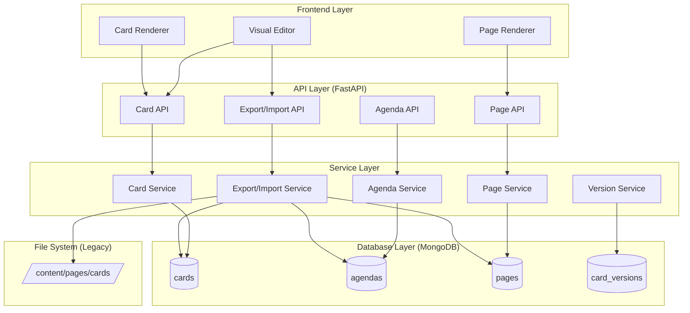

# Database Storage Implementation Plan
# Content Template System - MongoDB Persistence Layer

**Version:** 1.0
**Created:** January 12, 2026
**Status:** Planning Phase
**Estimated Effort:** 60-80 hours (3-4 weeks, 2 developers)

---

## Table of Contents

1. [Executive Summary](#1-executive-summary)
2. [Problem Statement & Requirements](#2-problem-statement--requirements)
3. [Architecture & Data Model](#3-architecture--data-model)
4. [Implementation Phases](#4-implementation-phases)
5. [API Specification](#5-api-specification)
6. [Migration Strategy](#6-migration-strategy)
7. [Visual Editor Integration](#7-visual-editor-integration)
8. [Testing Strategy](#8-testing-strategy)
9. [Security & Performance](#9-security--performance)
10. [Backup & Disaster Recovery](#10-backup--disaster-recovery)

---

## 1. Executive Summary

### 1.1 Current State

- **Storage**: Card definitions stored as Markdown files in `/frontend/public/content/pages/cards/`
- **Access**: File system not accessible from web UI
- **Problem**: No way to edit cards from visual editor without file system access
- **Limitation**: No versioning, backup, or import/export capabilities

### 1.2 Proposed Solution

- **Primary Storage**: MongoDB collections for cards, pages, and agendas
- **Web Access**: Full CRUD operations via REST API
- **Visual Editor**: Direct editing with live preview and database persistence
- **Import/Export**: Full backup/restore capabilities for individual cards or entire catalog
- **Migration**: Automated migration from filesystem to database
- **Versioning**: Track changes with version history

### 1.3 Key Benefits

✅ **Web Accessibility**: Edit cards from anywhere via browser
✅ **Collaboration**: Multiple users can work on cards (future enhancement)
✅ **Versioning**: Track all changes with rollback capability
✅ **Backup/Restore**: Export/import cards as portable YAML files
✅ **Performance**: Faster loading with database indexing
✅ **Validation**: Server-side schema validation before save

---

## 2. Problem Statement & Requirements

### 2.1 User Stories

**US-1: Content Creator - Edit from Visual Editor**
> As a content creator, I want to edit card definitions from the visual editor
> so that I can make changes without accessing the file system.

**US-2: Content Creator - Export Cards**
> As a content creator, I want to export my cards to local YAML files
> so that I can back them up or share them with others.

**US-3: Content Creator - Import Cards**
> As a content creator, I want to import cards from YAML files
> so that I can restore backups or use templates from others.

**US-4: Administrator - Migrate Existing Cards**
> As an administrator, I want to migrate existing file-based cards to the database
> so that all content is centrally managed.

**US-5: Developer - Version Control**
> As a developer, I want to track changes to cards over time
> so that I can understand evolution and rollback if needed.

### 2.2 Functional Requirements

**FR-1: Database Schema**
- Create MongoDB collections: `cards`, `agendas`, `pages`, `card_versions`
- Support all 31 section types from existing template system
- Maintain backward compatibility with existing YAML structure

**FR-2: REST API**
- GET /api/cards - List all cards
- GET /api/cards/:id - Get card with all pages
- POST /api/cards - Create new card
- PUT /api/cards/:id - Update card
- DELETE /api/cards/:id - Delete card
- POST /api/cards/:id/export - Export card to YAML
- POST /api/cards/import - Import card from YAML
- GET /api/cards/:id/versions - Get version history

**FR-3: Visual Editor Integration**
- Edit YAML directly in Monaco editor
- Real-time syntax validation
- Save button → persist to database
- Refresh button → reload from database
- Export button → download as .zip with all MD files

**FR-4: Migration Tools**
- CLI tool: `python migrate_cards_to_db.py`
- Reads all cards from `/content/pages/cards/`
- Validates and imports to MongoDB
- Generates migration report

**FR-5: Import/Export**
- Export format: `.zip` containing `card-definition.md`, `agenda.md`, `pages/*.md`
- Import supports single page or complete card
- Validation before import
- Conflict resolution (overwrite/skip/rename)

### 2.3 Non-Functional Requirements

**NFR-1: Performance**
- Card list loading: < 200ms
- Single card loading: < 100ms
- Save operation: < 500ms
- Export operation: < 2s for typical card

**NFR-2: Reliability**
- 99.9% uptime for database operations
- Automatic retry on transient failures (already implemented in MongoDB adapter)
- Transaction support for multi-document operations

**NFR-3: Security**
- Authentication required for all write operations
- Role-based access control (admin, editor, viewer)
- Input validation and sanitization
- No code injection via YAML

**NFR-4: Scalability**
- Support 1000+ cards
- Support 10,000+ pages
- Efficient indexing for search

---

## 3. Architecture & Data Model

### 3.1 Database Schema

#### Collection: `cards`

```typescript
interface CardDocument {
  _id: ObjectId;
  card_id: string;                    // Unique identifier (e.g., "observability")
  name: string;                       // Display name
  category: string;                   // Category (e.g., "technical")
  color_theme: string;                // Theme color
  icon: string;                       // Lucide icon name
  description: {
    short: string;
    long: string;
  };
  metadata: {
    author: string;
    version: string;
    last_updated: string;             // ISO 8601 timestamp
    tags: string[];
    difficulty: 'beginner' | 'intermediate' | 'advanced' | 'expert';
    estimated_time: string;
  };
  navigation: {
    type: 'hierarchical' | 'tabs' | 'linear';
    show_breadcrumbs: boolean;
    show_page_tree: boolean;
    allow_back_to_agenda: boolean;
    show_next_previous: boolean;
  };
  settings: {
    default_animation: string;
    transition_speed: string;
    max_depth: number;
  };
  agenda_ref: string;                 // Reference to agenda document ID
  created_at: Date;
  updated_at: Date;
  created_by: string;                 // User ID
  updated_by: string;                 // User ID
  version: number;                    // Version number for optimistic locking
  published: boolean;                 // Draft vs Published state
}
```

**Indexes:**
- `card_id`: Unique index
- `category`: Non-unique index for filtering
- `metadata.tags`: Multi-key index for search
- `created_at`: Index for sorting
- `published`: Index for filtering published cards

#### Collection: `agendas`

```typescript
interface AgendaDocument {
  _id: ObjectId;
  agenda_id: string;                  // Unique identifier
  card_ref: string;                   // Reference to card_id
  title: string;
  subtitle: string;
  layout: {
    type: 'grid' | 'list' | 'carousel';
    columns: 2 | 3 | 4;
    gap: 'small' | 'medium' | 'large';
  };
  animation: {
    type: string;
    delay_between_items: string;
  };
  items: AgendaItem[];
  created_at: Date;
  updated_at: Date;
  version: number;
}

interface AgendaItem {
  id: string;
  order: number;
  titles: {
    agenda_title: string;
  };
  description: string;
  icon: string;
  target: {
    type: 'page' | 'external_link';
    page_id?: string;                 // Reference to page document
    url?: string;
  };
  image?: string;
}
```

**Indexes:**
- `agenda_id`: Unique index
- `card_ref`: Non-unique index for lookups
- `items.target.page_id`: Multi-key index for page references

#### Collection: `pages`

```typescript
interface PageDocument {
  _id: ObjectId;
  page_id: string;                    // Unique identifier
  card_ref: string;                   // Reference to card_id
  titles: {
    page_header: string;
    menu_title: string;
    agenda_title: string;
    breadcrumb: string;
  };
  description: {
    short: string;
    long: string;
  };
  metadata: {
    author: string;
    version: string;
    last_updated: string;
    tags: string[];
    difficulty: string;
    estimated_time: string;
  };
  parent: string | null;              // Parent page_id for hierarchy
  icon: string;
  sections: Section[];                // Array of all 31 section types
  sub_pages: Array<{file: string}>;   // References to child pages
  popups: Popup[];
  navigation: object;                 // Page-specific navigation settings
  created_at: Date;
  updated_at: Date;
  version: number;
}

// Section is a discriminated union type (already defined in template-types)
type Section =
  | HeroSection
  | TextSection
  | ImageSection
  // ... all 31 types
```

**Indexes:**
- `page_id`: Unique index
- `card_ref`: Non-unique index
- `parent`: Non-unique index for hierarchy queries
- `metadata.tags`: Multi-key index
- `created_at`: Index for sorting

#### Collection: `card_versions`

```typescript
interface CardVersionDocument {
  _id: ObjectId;
  card_id: string;                    // Reference to original card
  version_number: number;
  snapshot: {
    card: CardDocument;
    agenda: AgendaDocument;
    pages: PageDocument[];
  };
  change_summary: string;
  changed_by: string;                 // User ID
  created_at: Date;
}
```

**Indexes:**
- `card_id, version_number`: Compound unique index
- `created_at`: Index for sorting

### 3.2 Architecture Diagram



### 3.3 Data Flow

#### Save Flow (Visual Editor → Database)

```
1. User edits YAML in Visual Editor
2. Click "Save" button
3. Frontend validates YAML syntax
4. POST /api/cards/:id with updated data
5. Backend validates against Zod schema
6. Transaction begins
7. Update card document
8. Update related agenda/pages documents
9. Create version snapshot
10. Transaction commits
11. Return success + new version number
12. Frontend shows "Saved" notification
```

#### Load Flow (Database → Visual Editor)

```
1. User opens Visual Editor
2. GET /api/cards/:id?include=agenda,pages
3. Backend fetches card + related documents
4. Transform to YAML format
5. Return as JSON
6. Frontend renders in Monaco editor
7. Live preview shows rendered card
```

#### Export Flow

```
1. User clicks "Export Card"
2. POST /api/cards/:id/export
3. Backend fetches card + agenda + pages
4. Transform each to Markdown with YAML frontmatter
5. Create .zip file structure:
   /card-definition.md
   /agenda.md
   /pages/page-1.md
   /pages/page-2.md
6. Return .zip file
7. Browser downloads file
```

#### Import Flow

```
1. User uploads .zip file
2. POST /api/cards/import (multipart/form-data)
3. Backend extracts .zip
4. Validate each .md file
5. Parse YAML from each file
6. Check for conflicts (existing card_id)
7. User chooses: overwrite | skip | rename
8. Transaction begins
9. Insert/update card + agenda + pages
10. Create initial version snapshot
11. Transaction commits
12. Return import summary
13. Frontend shows success notification
```

---

## 4. Implementation Phases

### Phase 1: Database Schema & Models (Week 1) - 20 hours

**Goal:** Set up MongoDB collections and Pydantic models

#### Tasks

**1.1 Create Pydantic Models** (8 hours)
- [ ] Create `backend/app/models/card_template.py`
- [ ] Define `CardDocument`, `AgendaDocument`, `PageDocument`
- [ ] Define all 31 Section type models (reuse from frontend types)
- [ ] Add validation rules (e.g., card_id format, required fields)
- [ ] Write 30+ unit tests for model validation

**1.2 Create Database Indexes** (4 hours)
- [ ] Create `backend/app/db/indexes.py`
- [ ] Define all indexes (see section 3.1)
- [ ] Write migration script to create indexes
- [ ] Test index performance with sample data
- [ ] Write 10+ tests for index creation

**1.3 Create Database Service Layer** (8 hours)
- [ ] Create `backend/app/services/card_template_service.py`
- [ ] Implement CRUD operations for cards
- [ ] Implement CRUD operations for agendas
- [ ] Implement CRUD operations for pages
- [ ] Add transaction support for multi-document operations
- [ ] Write 40+ unit tests (mock MongoDB adapter)

**Acceptance Criteria:**
- [ ] All models defined with proper validation
- [ ] All indexes created successfully
- [ ] All CRUD operations tested
- [ ] 80+ tests passing
- [ ] Code coverage > 90%

**Test Example:**

```python
# test_card_template_service.py

import pytest
from app.services.card_template_service import CardTemplateService
from app.models.card_template import CardDocument

@pytest.mark.asyncio
async def test_create_card_success():
    """Test creating a new card."""
    service = CardTemplateService(mock_db_adapter)

    card_data = {
        "card_id": "test-card",
        "name": "Test Card",
        "category": "technical",
        # ... other required fields
    }

    card_id = await service.create_card(card_data, user_id="user123")
    assert card_id is not None

    # Verify card was created
    card = await service.get_card("test-card")
    assert card.name == "Test Card"
    assert card.created_by == "user123"
    assert card.version == 1

@pytest.mark.asyncio
async def test_create_card_duplicate_id():
    """Test creating card with duplicate ID fails."""
    service = CardTemplateService(mock_db_adapter)

    # Create first card
    await service.create_card({"card_id": "dup-id", ...})

    # Attempt to create duplicate
    with pytest.raises(DuplicateCardError):
        await service.create_card({"card_id": "dup-id", ...})

@pytest.mark.asyncio
async def test_update_card_with_optimistic_locking():
    """Test optimistic locking prevents concurrent updates."""
    service = CardTemplateService(mock_db_adapter)

    # Create card
    card_id = await service.create_card({...})

    # Simulate concurrent updates
    card1 = await service.get_card(card_id)
    card2 = await service.get_card(card_id)

    # First update succeeds
    await service.update_card(card_id, {...}, version=1)

    # Second update fails (version mismatch)
    with pytest.raises(OptimisticLockError):
        await service.update_card(card_id, {...}, version=1)
```

---

### Phase 2: REST API Endpoints (Week 2) - 18 hours

**Goal:** Implement FastAPI endpoints for card management

#### Tasks

**2.1 Card Endpoints** (6 hours)
- [ ] Create `backend/app/api/card_templates.py`
- [ ] GET /api/v1/cards - List all cards (with pagination)
- [ ] GET /api/v1/cards/:id - Get card details
- [ ] POST /api/v1/cards - Create new card
- [ ] PUT /api/v1/cards/:id - Update card
- [ ] DELETE /api/v1/cards/:id - Delete card
- [ ] Add request/response models (Pydantic)
- [ ] Add authentication middleware
- [ ] Write 20+ integration tests

**2.2 Agenda & Page Endpoints** (6 hours)
- [ ] GET /api/v1/agendas/:card_id - Get agenda
- [ ] PUT /api/v1/agendas/:card_id - Update agenda
- [ ] GET /api/v1/pages/:page_id - Get page
- [ ] PUT /api/v1/pages/:page_id - Update page
- [ ] POST /api/v1/pages - Create page
- [ ] DELETE /api/v1/pages/:page_id - Delete page
- [ ] Write 20+ integration tests

**2.3 Export/Import Endpoints** (6 hours)
- [ ] POST /api/v1/cards/:id/export - Export card
- [ ] POST /api/v1/cards/import - Import card
- [ ] GET /api/v1/cards/:id/versions - Get version history
- [ ] POST /api/v1/cards/:id/versions/:version/restore - Restore version
- [ ] Write 15+ integration tests

**Acceptance Criteria:**
- [ ] All endpoints implemented
- [ ] All endpoints documented (OpenAPI/Swagger)
- [ ] Authentication enforced
- [ ] 55+ integration tests passing
- [ ] API response time < 200ms (average)

**API Example:**

```python
# backend/app/api/card_templates.py

from fastapi import APIRouter, Depends, HTTPException, status
from typing import List, Optional
from app.services.card_template_service import CardTemplateService
from app.models.card_template import CardDocument, CardCreateRequest, CardUpdateRequest
from app.middleware.auth_middleware import get_current_user

router = APIRouter(prefix="/api/v1/cards", tags=["Card Templates"])

@router.get("", response_model=List[CardDocument])
async def list_cards(
    skip: int = 0,
    limit: int = 100,
    category: Optional[str] = None,
    published: Optional[bool] = True,
    service: CardTemplateService = Depends(get_card_service)
):
    """
    List all cards with optional filtering.

    - **skip**: Number of cards to skip (pagination)
    - **limit**: Maximum number of cards to return
    - **category**: Filter by category
    - **published**: Filter by published status
    """
    return await service.list_cards(
        skip=skip,
        limit=limit,
        category=category,
        published=published
    )

@router.get("/{card_id}", response_model=CardDocument)
async def get_card(
    card_id: str,
    include_agenda: bool = False,
    include_pages: bool = False,
    service: CardTemplateService = Depends(get_card_service)
):
    """
    Get card by ID with optional related data.

    - **card_id**: Unique card identifier
    - **include_agenda**: Include agenda data
    - **include_pages**: Include all page data
    """
    card = await service.get_card(card_id, include_agenda, include_pages)
    if not card:
        raise HTTPException(status_code=404, detail=f"Card '{card_id}' not found")
    return card

@router.post("", response_model=CardDocument, status_code=status.HTTP_201_CREATED)
async def create_card(
    card_data: CardCreateRequest,
    user: dict = Depends(get_current_user),
    service: CardTemplateService = Depends(get_card_service)
):
    """
    Create a new card.

    Requires authentication. User must have 'editor' role.
    """
    if 'editor' not in user.get('roles', []):
        raise HTTPException(status_code=403, detail="Insufficient permissions")

    try:
        card_id = await service.create_card(card_data.dict(), user_id=user['id'])
        return await service.get_card(card_id)
    except DuplicateCardError as e:
        raise HTTPException(status_code=409, detail=str(e))
    except ValidationError as e:
        raise HTTPException(status_code=422, detail=str(e))

@router.put("/{card_id}", response_model=CardDocument)
async def update_card(
    card_id: str,
    card_data: CardUpdateRequest,
    user: dict = Depends(get_current_user),
    service: CardTemplateService = Depends(get_card_service)
):
    """
    Update existing card.

    Supports optimistic locking via version number.
    """
    try:
        await service.update_card(
            card_id,
            card_data.dict(exclude_unset=True),
            version=card_data.version,
            user_id=user['id']
        )
        return await service.get_card(card_id)
    except OptimisticLockError:
        raise HTTPException(
            status_code=409,
            detail="Card was modified by another user. Please refresh and try again."
        )
    except CardNotFoundError:
        raise HTTPException(status_code=404, detail=f"Card '{card_id}' not found")

@router.delete("/{card_id}", status_code=status.HTTP_204_NO_CONTENT)
async def delete_card(
    card_id: str,
    user: dict = Depends(get_current_user),
    service: CardTemplateService = Depends(get_card_service)
):
    """
    Delete a card and all related data (agenda, pages).

    Requires 'admin' role.
    """
    if 'admin' not in user.get('roles', []):
        raise HTTPException(status_code=403, detail="Admin role required")

    success = await service.delete_card(card_id)
    if not success:
        raise HTTPException(status_code=404, detail=f"Card '{card_id}' not found")
```

---

### Phase 3: Migration Tools (Week 2) - 12 hours

**Goal:** Migrate existing filesystem cards to database

#### Tasks

**3.1 Migration Script** (8 hours)
- [ ] Create `backend/scripts/migrate_cards_to_db.py`
- [ ] Read all cards from `/content/pages/cards/`
- [ ] Parse YAML from each .md file
- [ ] Validate against Pydantic models
- [ ] Insert into MongoDB collections
- [ ] Generate migration report (success/failures)
- [ ] Support dry-run mode (preview without committing)
- [ ] Write 15+ tests

**3.2 Rollback Script** (4 hours)
- [ ] Create `backend/scripts/rollback_migration.py`
- [ ] Export all cards from database to filesystem
- [ ] Restore original file structure
- [ ] Validate exported files
- [ ] Write 8+ tests

**Acceptance Criteria:**
- [ ] All existing cards migrated successfully
- [ ] Zero data loss
- [ ] Migration report generated
- [ ] Rollback script tested
- [ ] 23+ tests passing

**Migration Script Example:**

```python
# backend/scripts/migrate_cards_to_db.py

import asyncio
import yaml
from pathlib import Path
from rich.console import Console
from rich.table import Table
from app.services.card_template_service import CardTemplateService
from app.adapters.database import get_database_adapter

console = Console()

async def migrate_cards(dry_run: bool = False):
    """Migrate all cards from filesystem to database."""

    console.print("[bold blue]Card Migration Tool[/bold blue]")
    console.print(f"Dry run: {dry_run}\n")

    # Initialize service
    adapter = get_database_adapter()
    await adapter.connect()
    service = CardTemplateService(adapter)

    # Find all cards
    cards_dir = Path("frontend/public/content/pages/cards")
    card_folders = [f for f in cards_dir.iterdir() if f.is_dir()]

    console.print(f"Found {len(card_folders)} cards to migrate\n")

    # Migration results
    results = {
        "success": [],
        "failed": [],
        "skipped": []
    }

    for card_folder in card_folders:
        card_id = card_folder.name
        console.print(f"Processing: {card_id}...")

        try:
            # Read card definition
            card_def_path = card_folder / "card-definition.md"
            if not card_def_path.exists():
                results["failed"].append((card_id, "No card-definition.md found"))
                continue

            card_data = parse_card_definition(card_def_path)

            # Read agenda
            agenda_path = card_folder / "agenda.md"
            if agenda_path.exists():
                agenda_data = parse_agenda(agenda_path)
            else:
                agenda_data = None

            # Read all pages
            pages_dir = card_folder / "pages"
            pages_data = []
            if pages_dir.exists():
                for page_file in pages_dir.glob("*.md"):
                    pages_data.append(parse_page(page_file))

            # Dry run: just validate
            if dry_run:
                console.print(f"  ✓ Would migrate {card_id} with {len(pages_data)} pages")
                results["success"].append(card_id)
                continue

            # Check if already exists
            existing = await service.get_card(card_id)
            if existing:
                console.print(f"  ⚠ Card {card_id} already exists, skipping")
                results["skipped"].append(card_id)
                continue

            # Create card
            await service.create_card(card_data, user_id="migration")

            # Create agenda
            if agenda_data:
                await service.create_agenda(card_id, agenda_data, user_id="migration")

            # Create pages
            for page_data in pages_data:
                await service.create_page(card_id, page_data, user_id="migration")

            console.print(f"  ✓ Migrated {card_id} successfully")
            results["success"].append(card_id)

        except Exception as e:
            console.print(f"  ✗ Failed to migrate {card_id}: {e}")
            results["failed"].append((card_id, str(e)))

    # Print summary
    print_migration_summary(results)

    await adapter.disconnect()

def parse_card_definition(file_path: Path) -> dict:
    """Parse card-definition.md file."""
    content = file_path.read_text()
    # Extract YAML from code block
    yaml_content = extract_yaml_from_md(content)
    data = yaml.safe_load(yaml_content)
    return data.get('card', {})

def print_migration_summary(results: dict):
    """Print migration summary table."""
    table = Table(title="Migration Summary")
    table.add_column("Status", style="bold")
    table.add_column("Count", justify="right")
    table.add_column("Details")

    table.add_row("Success", str(len(results["success"])), "green")
    table.add_row("Failed", str(len(results["failed"])), "red")
    table.add_row("Skipped", str(len(results["skipped"])), "yellow")

    console.print(table)

    if results["failed"]:
        console.print("\n[bold red]Failures:[/bold red]")
        for card_id, error in results["failed"]:
            console.print(f"  - {card_id}: {error}")

if __name__ == "__main__":
    import sys
    dry_run = "--dry-run" in sys.argv
    asyncio.run(migrate_cards(dry_run=dry_run))
```

---

### Phase 4: Visual Editor Integration (Week 3) - 20 hours

**Goal:** Integrate database storage with visual editor

#### Tasks

**4.1 Frontend API Client** (6 hours)
- [ ] Create `frontend/src/api/cardTemplateApi.ts`
- [ ] Implement all API calls (CRUD, export, import)
- [ ] Add error handling and retry logic
- [ ] Add TypeScript types matching backend models
- [ ] Write 20+ unit tests (mock fetch)

**4.2 Editor State Management** (6 hours)
- [ ] Update `EditorContext` to use API instead of file system
- [ ] Add save/load methods calling API
- [ ] Add optimistic locking support
- [ ] Add conflict resolution UI
- [ ] Write 15+ tests

**4.3 Export/Import UI** (8 hours)
- [ ] Add "Export Card" button to editor
- [ ] Implement export download (.zip file)
- [ ] Add "Import Card" button with file upload
- [ ] Implement import wizard (conflict resolution)
- [ ] Add progress indicators
- [ ] Write 15+ tests

**Acceptance Criteria:**
- [ ] Editor can save to database
- [ ] Editor can load from database
- [ ] Export downloads .zip file
- [ ] Import uploads and validates .zip
- [ ] Conflict resolution works
- [ ] 50+ tests passing

**API Client Example:**

```typescript
// frontend/src/api/cardTemplateApi.ts

import { CardDefinition, AgendaDefinition, PageDefinition } from '@/lib/template-types';

interface CardResponse {
  _id: string;
  card_id: string;
  name: string;
  // ... all CardDocument fields
}

class CardTemplateAPI {
  private baseURL = '/api/v1/cards';

  /**
   * Get all cards with optional filtering
   */
  async listCards(options?: {
    skip?: number;
    limit?: number;
    category?: string;
    published?: boolean;
  }): Promise<CardResponse[]> {
    const params = new URLSearchParams();
    if (options?.skip) params.set('skip', options.skip.toString());
    if (options?.limit) params.set('limit', options.limit.toString());
    if (options?.category) params.set('category', options.category);
    if (options?.published !== undefined) params.set('published', options.published.toString());

    const response = await fetch(`${this.baseURL}?${params}`, {
      headers: {
        'Authorization': `Bearer ${this.getToken()}`,
      },
    });

    if (!response.ok) {
      throw new Error(`Failed to list cards: ${response.statusText}`);
    }

    return response.json();
  }

  /**
   * Get card by ID with optional related data
   */
  async getCard(
    cardId: string,
    options?: {
      includeAgenda?: boolean;
      includePages?: boolean;
    }
  ): Promise<CardResponse> {
    const params = new URLSearchParams();
    if (options?.includeAgenda) params.set('include_agenda', 'true');
    if (options?.includePages) params.set('include_pages', 'true');

    const response = await fetch(`${this.baseURL}/${cardId}?${params}`, {
      headers: {
        'Authorization': `Bearer ${this.getToken()}`,
      },
    });

    if (!response.ok) {
      if (response.status === 404) {
        throw new Error(`Card '${cardId}' not found`);
      }
      throw new Error(`Failed to get card: ${response.statusText}`);
    }

    return response.json();
  }

  /**
   * Create new card
   */
  async createCard(cardData: Partial<CardDefinition>): Promise<CardResponse> {
    const response = await fetch(this.baseURL, {
      method: 'POST',
      headers: {
        'Content-Type': 'application/json',
        'Authorization': `Bearer ${this.getToken()}`,
      },
      body: JSON.stringify(cardData),
    });

    if (!response.ok) {
      if (response.status === 409) {
        throw new Error('Card with this ID already exists');
      }
      if (response.status === 422) {
        const error = await response.json();
        throw new Error(`Validation error: ${JSON.stringify(error)}`);
      }
      throw new Error(`Failed to create card: ${response.statusText}`);
    }

    return response.json();
  }

  /**
   * Update existing card
   */
  async updateCard(
    cardId: string,
    cardData: Partial<CardDefinition>,
    version: number
  ): Promise<CardResponse> {
    const response = await fetch(`${this.baseURL}/${cardId}`, {
      method: 'PUT',
      headers: {
        'Content-Type': 'application/json',
        'Authorization': `Bearer ${this.getToken()}`,
      },
      body: JSON.stringify({ ...cardData, version }),
    });

    if (!response.ok) {
      if (response.status === 409) {
        throw new OptimisticLockError(
          'Card was modified by another user. Please refresh and try again.'
        );
      }
      throw new Error(`Failed to update card: ${response.statusText}`);
    }

    return response.json();
  }

  /**
   * Export card as .zip file
   */
  async exportCard(cardId: string): Promise<Blob> {
    const response = await fetch(`${this.baseURL}/${cardId}/export`, {
      method: 'POST',
      headers: {
        'Authorization': `Bearer ${this.getToken()}`,
      },
    });

    if (!response.ok) {
      throw new Error(`Failed to export card: ${response.statusText}`);
    }

    return response.blob();
  }

  /**
   * Import card from .zip file
   */
  async importCard(
    file: File,
    options?: {
      conflictResolution?: 'overwrite' | 'skip' | 'rename';
    }
  ): Promise<{ success: boolean; cardId: string; message: string }> {
    const formData = new FormData();
    formData.append('file', file);
    if (options?.conflictResolution) {
      formData.append('conflict_resolution', options.conflictResolution);
    }

    const response = await fetch(`${this.baseURL}/import`, {
      method: 'POST',
      headers: {
        'Authorization': `Bearer ${this.getToken()}`,
      },
      body: formData,
    });

    if (!response.ok) {
      throw new Error(`Failed to import card: ${response.statusText}`);
    }

    return response.json();
  }

  private getToken(): string {
    // Get JWT token from localStorage or auth context
    return localStorage.getItem('auth_token') || '';
  }
}

export class OptimisticLockError extends Error {
  constructor(message: string) {
    super(message);
    this.name = 'OptimisticLockError';
  }
}

export const cardTemplateApi = new CardTemplateAPI();
```

**Editor Integration Example:**

```typescript
// frontend/src/contexts/EditorContext.tsx (updated)

import { cardTemplateApi } from '@/api/cardTemplateApi';

export function EditorProvider({ children }: { children: React.ReactNode }) {
  const [state, dispatch] = useReducer(editorReducer, initialState);

  // Load card from database instead of filesystem
  const loadCard = async (cardId: string) => {
    try {
      dispatch({ type: 'LOAD_CARD_START' });

      // Fetch from API instead of file system
      const cardData = await cardTemplateApi.getCard(cardId, {
        includeAgenda: true,
        includePages: true,
      });

      // Transform API response to editor state format
      const card = transformCardResponse(cardData);
      const agenda = cardData.agenda;
      const pages = cardData.pages;

      dispatch({
        type: 'LOAD_CARD_SUCCESS',
        payload: { card, agenda, pages },
      });
    } catch (error) {
      dispatch({
        type: 'LOAD_CARD_ERROR',
        payload: { error: error.message },
      });
    }
  };

  // Save card to database instead of filesystem
  const saveCard = async () => {
    try {
      dispatch({ type: 'SAVE_START' });

      // Update via API
      await cardTemplateApi.updateCard(
        state.cardData.card_id,
        state.cardData,
        state.version
      );

      // Update agenda
      if (state.agendaData) {
        await agendaApi.updateAgenda(state.cardData.card_id, state.agendaData);
      }

      // Update pages
      for (const [pageId, pageData] of state.pagesMap.entries()) {
        await pageApi.updatePage(pageId, pageData);
      }

      dispatch({ type: 'SAVE_SUCCESS', payload: { timestamp: new Date() } });
    } catch (error) {
      if (error instanceof OptimisticLockError) {
        // Show conflict resolution UI
        dispatch({ type: 'SAVE_CONFLICT', payload: { error: error.message } });
      } else {
        dispatch({ type: 'SAVE_ERROR', payload: { error: error.message } });
      }
    }
  };

  // Export card as .zip
  const exportCard = async (cardId: string) => {
    try {
      const blob = await cardTemplateApi.exportCard(cardId);

      // Trigger download
      const url = URL.createObjectURL(blob);
      const a = document.createElement('a');
      a.href = url;
      a.download = `${cardId}-export.zip`;
      a.click();
      URL.revokeObjectURL(url);
    } catch (error) {
      console.error('Export failed:', error);
      // Show error notification
    }
  };

  // Import card from .zip
  const importCard = async (file: File, conflictResolution: 'overwrite' | 'skip' | 'rename') => {
    try {
      const result = await cardTemplateApi.importCard(file, { conflictResolution });

      // Show success notification
      console.log('Import successful:', result);

      // Reload card list
      // ... refresh logic
    } catch (error) {
      console.error('Import failed:', error);
      // Show error notification
    }
  };

  // ... rest of context implementation
}
```

---

### Phase 5: Testing & Quality Assurance (Week 4) - 10 hours

**Goal:** Comprehensive testing and quality assurance

#### Tasks

**5.1 Integration Tests** (4 hours)
- [ ] End-to-end tests for card creation flow
- [ ] End-to-end tests for card editing flow
- [ ] End-to-end tests for export/import flow
- [ ] Test error scenarios (network failures, conflicts)
- [ ] Write 20+ E2E tests (Playwright)

**5.2 Performance Testing** (3 hours)
- [ ] Load test: 1000+ cards in database
- [ ] Load test: Concurrent edits
- [ ] Measure API response times
- [ ] Optimize slow queries
- [ ] Write performance test suite

**5.3 Security Testing** (3 hours)
- [ ] Test authentication enforcement
- [ ] Test authorization (role-based access)
- [ ] Test input validation (prevent injection)
- [ ] Test file upload security
- [ ] Run security scan (OWASP ZAP)

**Acceptance Criteria:**
- [ ] All integration tests passing
- [ ] Performance meets NFRs
- [ ] No critical security vulnerabilities
- [ ] Load testing successful
- [ ] Documentation complete

---

## 5. API Specification

### 5.1 Base URL

```
Development: http://localhost:8000/api/v1
Production: https://bsg-demo-platform.azure.com/api/v1
```

### 5.2 Authentication

All endpoints require JWT authentication except for read-only public endpoints.

```http
Authorization: Bearer <JWT_TOKEN>
```

### 5.3 Endpoints Summary

| Method | Endpoint | Description | Auth | Role |
|--------|----------|-------------|------|------|
| GET | /cards | List all cards | Optional | - |
| GET | /cards/:id | Get card details | Optional | - |
| POST | /cards | Create new card | Required | Editor |
| PUT | /cards/:id | Update card | Required | Editor |
| DELETE | /cards/:id | Delete card | Required | Admin |
| POST | /cards/:id/export | Export card | Required | Viewer |
| POST | /cards/import | Import card | Required | Editor |
| GET | /cards/:id/versions | Get version history | Required | Viewer |
| POST | /cards/:id/versions/:ver/restore | Restore version | Required | Editor |
| GET | /agendas/:card_id | Get agenda | Optional | - |
| PUT | /agendas/:card_id | Update agenda | Required | Editor |
| GET | /pages/:page_id | Get page | Optional | - |
| PUT | /pages/:page_id | Update page | Required | Editor |
| POST | /pages | Create page | Required | Editor |
| DELETE | /pages/:page_id | Delete page | Required | Editor |

### 5.4 Request/Response Examples

**Create Card:**

```http
POST /api/v1/cards
Content-Type: application/json
Authorization: Bearer <token>

{
  "card_id": "new-feature",
  "name": "New Feature Guide",
  "category": "technical",
  "color_theme": "blue",
  "icon": "Zap",
  "description": {
    "short": "Quick guide to the new feature",
    "long": "Comprehensive documentation for the new feature release"
  },
  "metadata": {
    "author": "John Doe",
    "version": "1.0.0",
    "tags": ["feature", "guide"],
    "difficulty": "intermediate",
    "estimated_time": "15 minutes"
  },
  "navigation": {
    "type": "hierarchical",
    "show_breadcrumbs": true,
    "show_page_tree": true,
    "allow_back_to_agenda": true,
    "show_next_previous": true
  },
  "settings": {
    "default_animation": "fade-in",
    "transition_speed": "300ms",
    "max_depth": 5
  }
}
```

**Response:**

```json
{
  "_id": "65a1b2c3d4e5f6g7h8i9j0k1",
  "card_id": "new-feature",
  "name": "New Feature Guide",
  "category": "technical",
  "color_theme": "blue",
  "icon": "Zap",
  "description": {
    "short": "Quick guide to the new feature",
    "long": "Comprehensive documentation for the new feature release"
  },
  "metadata": {
    "author": "John Doe",
    "version": "1.0.0",
    "last_updated": "2026-01-12T10:30:00Z",
    "tags": ["feature", "guide"],
    "difficulty": "intermediate",
    "estimated_time": "15 minutes"
  },
  "navigation": {
    "type": "hierarchical",
    "show_breadcrumbs": true,
    "show_page_tree": true,
    "allow_back_to_agenda": true,
    "show_next_previous": true
  },
  "settings": {
    "default_animation": "fade-in",
    "transition_speed": "300ms",
    "max_depth": 5
  },
  "created_at": "2026-01-12T10:30:00Z",
  "updated_at": "2026-01-12T10:30:00Z",
  "created_by": "user123",
  "updated_by": "user123",
  "version": 1,
  "published": false
}
```

**Export Card:**

```http
POST /api/v1/cards/observability/export
Authorization: Bearer <token>
```

**Response:** Binary .zip file download

```
Content-Type: application/zip
Content-Disposition: attachment; filename="observability-export.zip"

[Binary ZIP data]
```

**Zip Structure:**
```
observability-export.zip
├── card-definition.md
├── agenda.md
└── pages/
    ├── introduction.md
    ├── pillars.md
    ├── stack.md
    └── temenos-approach.md
```

---

## 6. Migration Strategy

### 6.1 Migration Phases

**Phase 1: Dual Read (Week 1)**
- System reads from both filesystem AND database
- Filesystem is primary source
- Database is populated in background
- No user impact

**Phase 2: Database Primary (Week 2)**
- System reads from database
- Falls back to filesystem if not in database
- Visual editor writes to database only
- Migration script runs to move remaining cards

**Phase 3: Database Only (Week 3)**
- Filesystem deprecated
- All reads from database
- All writes to database
- Filesystem kept as backup only

### 6.2 Rollback Plan

If critical issues occur during migration:

1. **Immediate Rollback** (< 5 minutes)
   - Set feature flag `USE_DATABASE_STORAGE=false`
   - System reverts to filesystem mode
   - No data loss (filesystem still intact)

2. **Full Rollback** (< 1 hour)
   - Run `rollback_migration.py` script
   - Export all cards from database to filesystem
   - Validate exported files
   - Delete database collections

### 6.3 Data Validation

Before and after migration:

```python
# Validation script

async def validate_migration():
    """Validate all cards migrated correctly."""

    filesystem_cards = load_cards_from_filesystem()
    database_cards = await load_cards_from_database()

    report = {
        "total_filesystem": len(filesystem_cards),
        "total_database": len(database_cards),
        "missing_in_db": [],
        "mismatched": [],
    }

    for card_id, fs_card in filesystem_cards.items():
        db_card = database_cards.get(card_id)

        if not db_card:
            report["missing_in_db"].append(card_id)
            continue

        # Compare data
        if not cards_match(fs_card, db_card):
            report["mismatched"].append({
                "card_id": card_id,
                "differences": get_differences(fs_card, db_card)
            })

    return report
```

---

## 7. Visual Editor Integration

### 7.1 Updated Editor Specification

**File:** Update `templates/spec/VisualEditorSpecification.md`

**Changes:**

1. **Data Persistence Section** (NEW)
   ```markdown
   ### 2.3 Data Persistence

   **Primary Storage:** MongoDB Database
   **Secondary Storage:** Local filesystem (deprecated, backward compatibility only)
   **Versioning:** Git-like version history in database

   **Save Flow:**
   1. User edits YAML in Monaco editor
   2. Syntax validation (client-side)
   3. Click "Save" button
   4. POST to /api/v1/cards/:id
   5. Server validates and saves
   6. Version snapshot created
   7. Success notification shown

   **Load Flow:**
   1. GET /api/v1/cards/:id?include=agenda,pages
   2. Transform to YAML
   3. Render in Monaco editor
   4. Live preview updates
   ```

2. **Export/Import Section** (NEW)
   ```markdown
   ### 4.5 Export/Import UI

   **Export Button:**
   - Location: Editor header, next to Save button
   - Icon: Download icon
   - Action: Downloads .zip file with all card files
   - Filename: `{card-id}-export.zip`

   **Import Button:**
   - Location: Card gallery, "New Card" dropdown
   - Icon: Upload icon
   - Action: Opens file picker (.zip files only)
   - Wizard: 3 steps
     1. Upload file
     2. Validate contents
     3. Resolve conflicts (if any)

   **Conflict Resolution:**
   - If card_id already exists:
     - Option 1: Overwrite (requires admin role)
     - Option 2: Skip
     - Option 3: Rename (append timestamp)
   ```

### 7.2 UI Components

**Export Button Component:**

```typescript
// frontend/src/components/editor/ExportButton.tsx

import { Download } from 'lucide-react';
import { useEditor } from '@/contexts/EditorContext';
import { cardTemplateApi } from '@/api/cardTemplateApi';

export function ExportButton() {
  const { state } = useEditor();
  const [exporting, setExporting] = useState(false);

  const handleExport = async () => {
    if (!state.cardData) return;

    setExporting(true);
    try {
      const blob = await cardTemplateApi.exportCard(state.cardData.card_id);

      // Trigger download
      const url = URL.createObjectURL(blob);
      const a = document.createElement('a');
      a.href = url;
      a.download = `${state.cardData.card_id}-export.zip`;
      a.click();
      URL.revokeObjectURL(url);

      // Show success notification
      toast.success('Card exported successfully');
    } catch (error) {
      console.error('Export failed:', error);
      toast.error('Failed to export card');
    } finally {
      setExporting(false);
    }
  };

  return (
    <button
      onClick={handleExport}
      disabled={exporting || !state.cardData}
      className="flex items-center gap-2 px-4 py-2 bg-blue-600 text-white rounded-md hover:bg-blue-700 disabled:opacity-50"
      aria-label="Export card"
    >
      <Download size={16} />
      {exporting ? 'Exporting...' : 'Export'}
    </button>
  );
}
```

**Import Wizard Component:**

```typescript
// frontend/src/components/editor/ImportWizard.tsx

import { Upload } from 'lucide-react';
import { useState } from 'react';
import { cardTemplateApi } from '@/api/cardTemplateApi';

export function ImportWizard({ onClose, onSuccess }: Props) {
  const [step, setStep] = useState<'upload' | 'validate' | 'conflict'>('upload');
  const [file, setFile] = useState<File | null>(null);
  const [conflictResolution, setConflictResolution] = useState<'overwrite' | 'skip' | 'rename'>('rename');
  const [importing, setImporting] = useState(false);

  const handleUpload = (e: React.ChangeEvent<HTMLInputElement>) => {
    const uploadedFile = e.target.files?.[0];
    if (uploadedFile && uploadedFile.name.endsWith('.zip')) {
      setFile(uploadedFile);
      setStep('validate');
    }
  };

  const handleImport = async () => {
    if (!file) return;

    setImporting(true);
    try {
      const result = await cardTemplateApi.importCard(file, { conflictResolution });

      toast.success(`Card '${result.cardId}' imported successfully`);
      onSuccess(result.cardId);
      onClose();
    } catch (error) {
      console.error('Import failed:', error);
      toast.error('Failed to import card');
    } finally {
      setImporting(false);
    }
  };

  return (
    <div className="fixed inset-0 bg-black/50 flex items-center justify-center z-50">
      <div className="bg-white dark:bg-gray-800 rounded-lg p-6 max-w-md w-full">
        <h2 className="text-2xl font-bold mb-4">Import Card</h2>

        {step === 'upload' && (
          <div>
            <p className="mb-4">Select a .zip file containing card definition:</p>
            <input
              type="file"
              accept=".zip"
              onChange={handleUpload}
              className="mb-4"
            />
          </div>
        )}

        {step === 'validate' && (
          <div>
            <p className="mb-4">File: {file?.name}</p>
            <p className="mb-4">Validating contents...</p>
            <div className="mb-4">
              <label className="block mb-2">If card exists:</label>
              <select
                value={conflictResolution}
                onChange={(e) => setConflictResolution(e.target.value as any)}
                className="w-full p-2 border rounded"
              >
                <option value="rename">Rename (add timestamp)</option>
                <option value="skip">Skip import</option>
                <option value="overwrite">Overwrite existing</option>
              </select>
            </div>
            <button
              onClick={handleImport}
              disabled={importing}
              className="w-full bg-blue-600 text-white py-2 rounded hover:bg-blue-700"
            >
              {importing ? 'Importing...' : 'Import Card'}
            </button>
          </div>
        )}

        <button
          onClick={onClose}
          className="mt-4 w-full border border-gray-300 py-2 rounded hover:bg-gray-100"
        >
          Cancel
        </button>
      </div>
    </div>
  );
}
```

---

## 8. Testing Strategy

### 8.1 Test-Driven Development

**Red-Green-Refactor Cycle:**

1. **Write Test First** - Define expected behavior
2. **Run Test** - Verify it fails (RED)
3. **Write Minimum Code** - Make test pass (GREEN)
4. **Refactor** - Improve code quality
5. **Run Tests Again** - Ensure still passing

### 8.2 Test Coverage Requirements

| Layer | Coverage Target | Test Types |
|-------|----------------|------------|
| Models (Pydantic) | > 95% | Unit tests (validation, serialization) |
| Services | > 90% | Unit tests (mock database) |
| API Endpoints | > 85% | Integration tests (real database) |
| Frontend API Client | > 90% | Unit tests (mock fetch) |
| Editor Components | > 85% | Component tests (React Testing Library) |
| E2E Flows | 100% critical paths | Playwright tests |

### 8.3 Test Categories

**Unit Tests (Backend):**
- Model validation
- Service layer logic
- Utility functions
- Error handling

**Integration Tests (Backend):**
- API endpoint behavior
- Database operations
- Transaction handling
- Authentication/authorization

**Unit Tests (Frontend):**
- API client methods
- Editor state management
- Component rendering
- Event handlers

**Component Tests (Frontend):**
- User interactions
- Form submissions
- Error states
- Loading states

**End-to-End Tests:**
- Complete card creation flow
- Complete card editing flow
- Export/import flow
- Migration flow
- Conflict resolution

### 8.4 Test Examples

**Backend Unit Test:**

```python
# test_card_template_service.py

import pytest
from unittest.mock import AsyncMock, MagicMock
from app.services.card_template_service import CardTemplateService
from app.models.card_template import CardDocument

@pytest.fixture
def mock_adapter():
    """Mock database adapter."""
    adapter = MagicMock()
    adapter.find_one = AsyncMock(return_value=None)
    adapter.insert_one = AsyncMock(return_value="mock_id_123")
    adapter.update_one = AsyncMock(return_value=True)
    adapter.find_many = AsyncMock(return_value=[])
    return adapter

@pytest.mark.asyncio
async def test_create_card_with_all_required_fields(mock_adapter):
    """Test creating card with all required fields."""
    service = CardTemplateService(mock_adapter)

    card_data = {
        "card_id": "test-card",
        "name": "Test Card",
        "category": "technical",
        "color_theme": "blue",
        "icon": "FileText",
        "description": {
            "short": "Short description",
            "long": "Long description"
        },
        "metadata": {
            "author": "Test Author",
            "version": "1.0.0",
            "tags": ["test"],
            "difficulty": "beginner",
            "estimated_time": "10 minutes"
        },
        "navigation": {
            "type": "hierarchical",
            "show_breadcrumbs": True,
            "show_page_tree": True,
            "allow_back_to_agenda": True,
            "show_next_previous": True
        },
        "settings": {
            "default_animation": "fade-in",
            "transition_speed": "300ms",
            "max_depth": 5
        }
    }

    card_id = await service.create_card(card_data, user_id="test_user")

    assert card_id == "mock_id_123"
    mock_adapter.insert_one.assert_called_once()

    # Verify data structure passed to database
    call_args = mock_adapter.insert_one.call_args
    saved_data = call_args[0][1]  # Second argument to insert_one

    assert saved_data["card_id"] == "test-card"
    assert saved_data["name"] == "Test Card"
    assert saved_data["created_by"] == "test_user"
    assert saved_data["version"] == 1
    assert "created_at" in saved_data
    assert "updated_at" in saved_data

@pytest.mark.asyncio
async def test_create_card_with_duplicate_id_raises_error(mock_adapter):
    """Test that creating card with duplicate ID raises error."""
    service = CardTemplateService(mock_adapter)

    # Mock existing card
    mock_adapter.find_one = AsyncMock(return_value={
        "_id": "existing_id",
        "card_id": "duplicate-id"
    })

    card_data = {"card_id": "duplicate-id", "name": "Duplicate"}

    with pytest.raises(DuplicateCardError) as exc_info:
        await service.create_card(card_data, user_id="test_user")

    assert "duplicate-id" in str(exc_info.value)

@pytest.mark.asyncio
async def test_update_card_with_version_mismatch_raises_error(mock_adapter):
    """Test optimistic locking prevents concurrent updates."""
    service = CardTemplateService(mock_adapter)

    # Mock existing card with version 2
    mock_adapter.find_one = AsyncMock(return_value={
        "_id": "card_id_123",
        "card_id": "test-card",
        "version": 2
    })

    # Attempt update with old version 1
    with pytest.raises(OptimisticLockError):
        await service.update_card(
            "test-card",
            {"name": "Updated Name"},
            version=1,
            user_id="test_user"
        )

@pytest.mark.asyncio
async def test_list_cards_with_pagination(mock_adapter):
    """Test listing cards with pagination."""
    service = CardTemplateService(mock_adapter)

    mock_adapter.find_many = AsyncMock(return_value=[
        {"_id": "1", "card_id": "card-1", "name": "Card 1"},
        {"_id": "2", "card_id": "card-2", "name": "Card 2"},
    ])

    cards = await service.list_cards(skip=10, limit=20, category="technical")

    assert len(cards) == 2
    mock_adapter.find_many.assert_called_once_with(
        "cards",
        filter={"category": "technical", "published": True},
        skip=10,
        limit=20
    )
```

**Frontend Component Test:**

```typescript
// ExportButton.test.tsx

import { render, screen, fireEvent, waitFor } from '@testing-library/react';
import { ExportButton } from './ExportButton';
import { EditorProvider } from '@/contexts/EditorContext';
import { cardTemplateApi } from '@/api/cardTemplateApi';

// Mock API
jest.mock('@/api/cardTemplateApi');

describe('ExportButton', () => {
  beforeEach(() => {
    jest.clearAllMocks();
  });

  it('should render export button', () => {
    render(
      <EditorProvider>
        <ExportButton />
      </EditorProvider>
    );

    expect(screen.getByLabelText('Export card')).toBeInTheDocument();
    expect(screen.getByText('Export')).toBeInTheDocument();
  });

  it('should be disabled when no card loaded', () => {
    render(
      <EditorProvider>
        <ExportButton />
      </EditorProvider>
    );

    const button = screen.getByLabelText('Export card');
    expect(button).toBeDisabled();
  });

  it('should export card on click', async () => {
    // Mock successful export
    const mockBlob = new Blob(['test'], { type: 'application/zip' });
    (cardTemplateApi.exportCard as jest.Mock).mockResolvedValue(mockBlob);

    // Mock URL.createObjectURL
    global.URL.createObjectURL = jest.fn(() => 'mock-url');
    global.URL.revokeObjectURL = jest.fn();

    // Mock link click
    const mockClick = jest.fn();
    document.createElement = jest.fn((tag) => {
      if (tag === 'a') {
        return {
          click: mockClick,
          setAttribute: jest.fn(),
        } as any;
      }
      return document.createElement(tag);
    });

    render(
      <EditorProvider initialCard={{ card_id: 'test-card' }}>
        <ExportButton />
      </EditorProvider>
    );

    const button = screen.getByLabelText('Export card');
    fireEvent.click(button);

    await waitFor(() => {
      expect(cardTemplateApi.exportCard).toHaveBeenCalledWith('test-card');
      expect(mockClick).toHaveBeenCalled();
      expect(screen.getByText('Card exported successfully')).toBeInTheDocument();
    });
  });

  it('should show error on export failure', async () => {
    (cardTemplateApi.exportCard as jest.Mock).mockRejectedValue(
      new Error('Network error')
    );

    render(
      <EditorProvider initialCard={{ card_id: 'test-card' }}>
        <ExportButton />
      </EditorProvider>
    );

    const button = screen.getByLabelText('Export card');
    fireEvent.click(button);

    await waitFor(() => {
      expect(screen.getByText('Failed to export card')).toBeInTheDocument();
    });
  });

  it('should show loading state while exporting', async () => {
    (cardTemplateApi.exportCard as jest.Mock).mockImplementation(
      () => new Promise((resolve) => setTimeout(resolve, 1000))
    );

    render(
      <EditorProvider initialCard={{ card_id: 'test-card' }}>
        <ExportButton />
      </EditorProvider>
    );

    const button = screen.getByLabelText('Export card');
    fireEvent.click(button);

    expect(screen.getByText('Exporting...')).toBeInTheDocument();
    expect(button).toBeDisabled();
  });
});
```

**E2E Test:**

```typescript
// e2e/card-export-import.spec.ts

import { test, expect } from '@playwright/test';
import path from 'path';

test.describe('Card Export/Import', () => {
  test('should export and reimport card successfully', async ({ page }) => {
    // Login
    await page.goto('/login');
    await page.fill('[name="email"]', 'test@example.com');
    await page.fill('[name="password"]', 'password123');
    await page.click('[type="submit"]');

    // Open editor for observability card
    await page.goto('/editor/observability');
    await expect(page.getByText('Observability Guide')).toBeVisible();

    // Export card
    const downloadPromise = page.waitForEvent('download');
    await page.click('[aria-label="Export card"]');
    const download = await downloadPromise;

    // Verify download filename
    expect(download.suggestedFilename()).toBe('observability-export.zip');

    // Save downloaded file
    const exportPath = path.join(__dirname, 'temp', 'observability-export.zip');
    await download.saveAs(exportPath);

    // Delete original card (admin only)
    await page.goto('/admin/cards');
    await page.click('[data-card-id="observability"] [aria-label="Delete"]');
    await page.click('[role="dialog"] button:has-text("Confirm")');
    await expect(page.getByText('Card deleted')).toBeVisible();

    // Import card back
    await page.goto('/editor/new');
    await page.click('[aria-label="Import card"]');

    // Upload file
    await page.setInputFiles('[type="file"]', exportPath);

    // Select conflict resolution
    await page.selectOption('[name="conflict-resolution"]', 'rename');

    // Confirm import
    await page.click('button:has-text("Import Card")');

    // Verify success
    await expect(page.getByText('Card imported successfully')).toBeVisible();

    // Verify card exists with new name
    await page.goto('/gallery');
    await expect(page.getByText('Observability Guide')).toBeVisible();
  });

  test('should handle import conflict resolution', async ({ page }) => {
    await page.goto('/editor/new');
    await page.click('[aria-label="Import card"]');

    // Upload file for existing card
    await page.setInputFiles('[type="file"]', 'test-data/observability-export.zip');

    // System detects conflict
    await expect(page.getByText('Card "observability" already exists')).toBeVisible();

    // Choose overwrite
    await page.selectOption('[name="conflict-resolution"]', 'overwrite');

    // Warning shown
    await expect(page.getByText('This will replace the existing card')).toBeVisible();

    // Confirm
    await page.click('button:has-text("Import Card")');

    // Verify success
    await expect(page.getByText('Card imported successfully')).toBeVisible();
  });
});
```

---

## 9. Security & Performance

### 9.1 Security Measures

**Authentication & Authorization:**
- JWT-based authentication for all API requests
- Role-based access control (RBAC):
  - **Viewer**: Can read cards, export cards
  - **Editor**: Can create, update cards
  - **Admin**: Can delete cards, manage users

**Input Validation:**
- Server-side validation using Pydantic models
- YAML schema validation before save
- File upload restrictions (.zip only, max 10MB)
- Sanitize all user inputs to prevent injection

**Data Protection:**
- Encrypted connections (HTTPS/TLS)
- MongoDB authentication enabled
- Connection string stored in environment variables
- No sensitive data in logs

**Rate Limiting:**
- API rate limiting: 100 requests/minute per user
- Export rate limiting: 10 exports/hour per user
- Import rate limiting: 5 imports/hour per user

**Audit Logging:**
- Log all write operations (create, update, delete)
- Log user who made changes
- Log timestamp of changes
- Store in `audit_log` collection

### 9.2 Performance Optimization

**Database Indexes:**
- Create indexes on frequently queried fields
- Compound indexes for common queries
- Regular index maintenance and optimization

**Caching:**
- Cache card list in Redis (TTL: 5 minutes)
- Cache individual cards (TTL: 1 minute)
- Invalidate cache on updates

**Query Optimization:**
- Use projections to fetch only needed fields
- Paginate large result sets
- Use aggregation pipeline for complex queries

**Frontend Optimization:**
- Lazy load large card lists (virtual scrolling)
- Debounce save operations (5 seconds)
- Compress API responses (gzip)
- Use CDN for static assets

**Monitoring:**
- Track API response times (target: < 200ms)
- Alert on slow queries (> 500ms)
- Monitor database connection pool usage
- Track error rates

### 9.3 Performance Benchmarks

| Operation | Target | Critical |
|-----------|--------|----------|
| List cards (100 items) | < 200ms | < 500ms |
| Get single card | < 100ms | < 200ms |
| Create card | < 300ms | < 500ms |
| Update card | < 200ms | < 400ms |
| Export card | < 2s | < 5s |
| Import card | < 3s | < 10s |
| Migration (1000 cards) | < 10min | < 30min |

---

## 10. Backup & Disaster Recovery

### 10.1 Backup Strategy

**Automated Backups:**
- **Frequency**: Daily at 2 AM UTC
- **Retention**: 30 days rolling
- **Storage**: Azure Blob Storage
- **Format**: MongoDB dump (BSON) + JSON export

**Manual Backups:**
- Before major migrations
- Before system upgrades
- On-demand via admin panel

**Backup Script:**

```python
# backend/scripts/backup_database.py

import asyncio
from datetime import datetime
from pathlib import Path
import subprocess
import json
from app.adapters.database import get_database_adapter
from app.services.card_template_service import CardTemplateService

async def backup_database(output_dir: Path):
    """Create full database backup."""

    timestamp = datetime.utcnow().strftime('%Y%m%d_%H%M%S')
    backup_dir = output_dir / f"backup_{timestamp}"
    backup_dir.mkdir(parents=True, exist_ok=True)

    # 1. MongoDB dump (BSON format)
    print("Creating MongoDB dump...")
    subprocess.run([
        "mongodump",
        "--uri", settings.DATABASE_URL,
        "--out", str(backup_dir / "mongodb_dump")
    ], check=True)

    # 2. JSON export (human-readable)
    print("Exporting cards to JSON...")
    adapter = get_database_adapter()
    await adapter.connect()
    service = CardTemplateService(adapter)

    cards = await service.list_cards(limit=10000)

    json_dir = backup_dir / "json_export"
    json_dir.mkdir(exist_ok=True)

    for card in cards:
        card_id = card['card_id']
        card_data = await service.get_card(card_id, include_agenda=True, include_pages=True)

        # Export to JSON
        with open(json_dir / f"{card_id}.json", 'w') as f:
            json.dump(card_data, f, indent=2, default=str)

    # 3. Create manifest
    manifest = {
        "backup_timestamp": timestamp,
        "total_cards": len(cards),
        "database_name": settings.DATABASE_NAME,
        "backup_format": "mongodb_dump + json_export"
    }

    with open(backup_dir / "manifest.json", 'w') as f:
        json.dump(manifest, f, indent=2)

    print(f"Backup created: {backup_dir}")
    await adapter.disconnect()

if __name__ == "__main__":
    import sys
    output_dir = Path(sys.argv[1]) if len(sys.argv) > 1 else Path("backups")
    asyncio.run(backup_database(output_dir))
```

### 10.2 Disaster Recovery

**Recovery Time Objective (RTO):** < 4 hours
**Recovery Point Objective (RPO):** < 24 hours

**Recovery Procedure:**

1. **Assess Damage**
   - Identify corrupted collections
   - Check last successful backup
   - Estimate data loss window

2. **Restore from Backup**
   ```bash
   # Restore MongoDB dump
   mongorestore --uri="mongodb://..." --drop backups/backup_20260112_020000/mongodb_dump

   # OR restore from JSON
   python scripts/restore_from_json.py backups/backup_20260112_020000/json_export
   ```

3. **Validate Restoration**
   ```python
   # Run validation script
   python scripts/validate_database.py
   ```

4. **Rebuild Indexes**
   ```python
   python scripts/create_indexes.py
   ```

5. **Test System**
   - Load visual editor
   - Create test card
   - Update test card
   - Export test card
   - Delete test card

6. **Resume Operations**
   - Enable API endpoints
   - Notify users of restoration

### 10.3 Data Integrity Checks

**Daily Checks:**
- Verify all cards have required fields
- Check for orphaned pages (no parent card)
- Validate section schemas
- Check referential integrity (agenda → pages)

**Weekly Checks:**
- Full database consistency check
- Index fragmentation analysis
- Storage usage monitoring

**Integrity Check Script:**

```python
# backend/scripts/check_data_integrity.py

async def check_data_integrity():
    """Check database for integrity issues."""

    issues = []

    # 1. Check for cards without agendas
    cards_without_agenda = await db.find_many(
        "cards",
        filter={"agenda_ref": {"$exists": False}}
    )
    if cards_without_agenda:
        issues.append({
            "type": "missing_agenda",
            "count": len(cards_without_agenda),
            "cards": [c["card_id"] for c in cards_without_agenda]
        })

    # 2. Check for orphaned pages
    all_pages = await db.find_many("pages")
    all_cards = await db.find_many("cards")
    card_ids = {c["card_id"] for c in all_cards}

    orphaned_pages = [
        p for p in all_pages
        if p.get("card_ref") not in card_ids
    ]
    if orphaned_pages:
        issues.append({
            "type": "orphaned_pages",
            "count": len(orphaned_pages),
            "pages": [p["page_id"] for p in orphaned_pages]
        })

    # 3. Check for invalid section types
    for page in all_pages:
        for section in page.get("sections", []):
            if section.get("type") not in VALID_SECTION_TYPES:
                issues.append({
                    "type": "invalid_section_type",
                    "page_id": page["page_id"],
                    "section_type": section.get("type")
                })

    return issues
```

---

## Summary & Next Steps

### Implementation Timeline

**Week 1: Database Schema & Models**
- Create Pydantic models
- Create database indexes
- Implement service layer
- Write 80+ tests

**Week 2: REST API & Migration**
- Implement API endpoints
- Create migration scripts
- Write 55+ tests
- Run migration on test data

**Week 3: Visual Editor Integration**
- Update editor to use API
- Implement export/import UI
- Write 50+ tests
- User acceptance testing

**Week 4: Testing & Deployment**
- Integration testing
- Performance testing
- Security audit
- Production deployment

### Success Criteria

✅ All tests passing (200+ tests)
✅ Performance benchmarks met
✅ Zero data loss during migration
✅ Visual editor fully functional
✅ Export/import working smoothly
✅ Documentation complete
✅ User acceptance testing passed

### Risk Mitigation

| Risk | Probability | Impact | Mitigation |
|------|-------------|--------|------------|
| Data loss during migration | Low | High | Comprehensive backups, dry-run testing, rollback plan |
| Performance degradation | Medium | Medium | Load testing, indexing, caching strategy |
| User adoption issues | Low | Medium | Training documentation, intuitive UI |
| Security vulnerabilities | Low | High | Security audit, penetration testing |
| Timeline overrun | Medium | Low | Phased rollout, MVP first |

---

**Document Version:** 1.0
**Last Updated:** January 12, 2026
**Status:** Ready for Review & Implementation
**Next Review:** After Phase 1 completion
