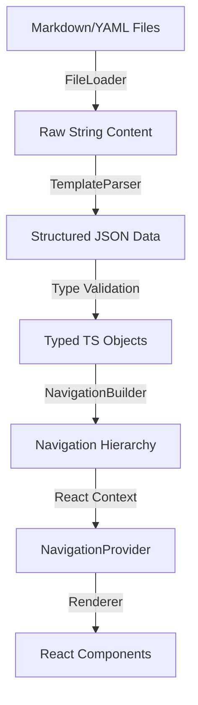

# Project Architecture: Content Template System

**Version:** 1.0 (Based on Phase 2 Specifications)
**Scope:** Frontend Content Rendering Engine

## 1. High-Level Overview

The **Content Template System** is a platform design that allows content creators to build rich, interactive web pages using simple Markdown/YAML templates, without writing React code. It effectively acts as a "Headless CMS" where the filesystem is the database and Markdown files are the entries.

**Core Philosophy:** "Content is Data, Renderer is Code."

## 2. Architecture Pipeline

The system follows a strict unidirectional data flow:

### 2.1 File Layer (The "Database")
- Located in `/content/pages/`
- **Format:** Markdown with strict YAML frontmatter.
- **Structure:** Hierarchical folders representing the navigation tree.
- **Key Files:**
    - `card-definition.md`: Defines a module ("Card") and its settings.
    - `agenda.md`: The landing page for a card.
    - `page-template.md`: Individual content pages.

### 2.2 Parser Layer (The "Backend" Logic)
Located in `frontend/src/lib/template-parser/`.
- **`file-loader.ts`**: Fetches raw content (supports caching).
- **`yaml-utils.ts`**: Extracts and validates YAML using `gray-matter`.
- **`section-parser.ts`**: The core logic that maps raw YAML objects to strict TypeScript interfaces.
- **`navigation-builder.ts`**: Recursively builds the page tree, detecting circular references and orphans.

### 2.3 Type System (The Contract)
Located in `frontend/src/lib/template-types/`.
- **Strict Interfaces**: Every piece of data has a TypeScript interface.
- **`Section` Union Type**: A discriminated union of all 31 supported section types (e.g., `HeroSection | TextSection | ImageSection`).
- **Discriminated Unions**: Usage of `type: 'hero'` fields allows TS to narrow types automatically.

### 2.4 Rendering Layer (The View)
Located in `frontend/src/components/template-renderer/`.
- **`CardRenderer`**: The main orchestrator. Switches between `AgendaRenderer` and `PageRenderer` based on `currentPage` state.
- **`NavigationProvider`**: The central state engine. 
    - Integrates `useTemplateParser` for client-side fetching.
    - Uses `NavigationBuilder` to transform flat page maps into hierarchical trees.
    - Exposes `navigateToPage(id)`, `getPage(id)`, and `goBack()` to all child components.
- **`PageRenderer`**: Renders a specific `PageDefinition`, integrating `Breadcrumbs`, `PageTree` (sidebar), and the `SectionRenderer`.
- **`SectionRenderer`**: A registry-based switcher that maps `Section.type` to specific UI components (31+ types).

## 3. Key Technical Decisions & Implementation Notes

### ID Consistency
- **Standard**: Always use `id` for internal unique identifiers and `page_id` for navigation targets in Agenda/ClickActions.
- **Note**: The parser maps these during the normalization phase in `useTemplateParser.ts`.

### Prop Standardization
- **Content Sections**: Standardized on `heading` for main section titles (e.g., in `HeroSection`) to maintain strict compliance with `lib/template-types`. Avoid using `title` as a top-level prop for these sections.

### Navigation Hierarchy
- **Recursive**: Supports infinite nesting depth (tested up to 5 levels).
- **Cycle Detection**: `NavigationBuilder` detects circular parent references (A -> B -> A) and throws a `ParseError` during the loading phase.
- **Breadcrumbs**: Automatically generated by walking up the `parent` chain in the `NavigationHierarchy`.

## 4. Component Library
The system abstracts UI into reusable "Sections".
- **Content**: Hero, Text, Image, Video, Embed.
- **Navigation**: Clickable Cards, Feature Grids, Image Clickable.
- **Data**: Timelines, Comparison Tables, Key-Value Pairs.
- **Interaction**: Accordions, Expandable Sections, Expandable Cards, Interactive Diagrams (Hotspots).

## 5. Developer "Memory" (For Next Session)

> [!TIP]
> **To start work in the next session:**
> 1. **Check Types**: Always verify new section interfaces in `frontend/src/lib/template-types/`.
> 2. **Registry**: Register any new section in `frontend/src/components/template-renderer/SectionRenderer.tsx`.
> 3. **Validation**: Use `EndToEndCard.test.tsx` as the source of truth for integration stability.
> 4. **Mocking**: When unit testing sections, mock `useClickAction` or `usePopup` if they involve interactivity.
> 5. **Scrolling**: `NavigationProvider` includes a `window.scrollTo(0,0)` on every page change; remember to mock this in Vitest.

## 6. Security & Performance
- **Sanitization**: All Markdown content is sanitized.
- **Latency**: Navigation is optimized to <50ms by keeping the `pagesMap` in memory after the initial load.
- **Validation**: Strict schema validation ensures malformed YAML does not crash the UI.
