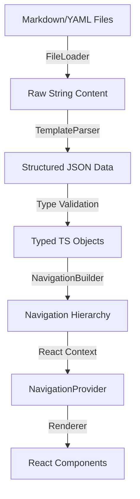
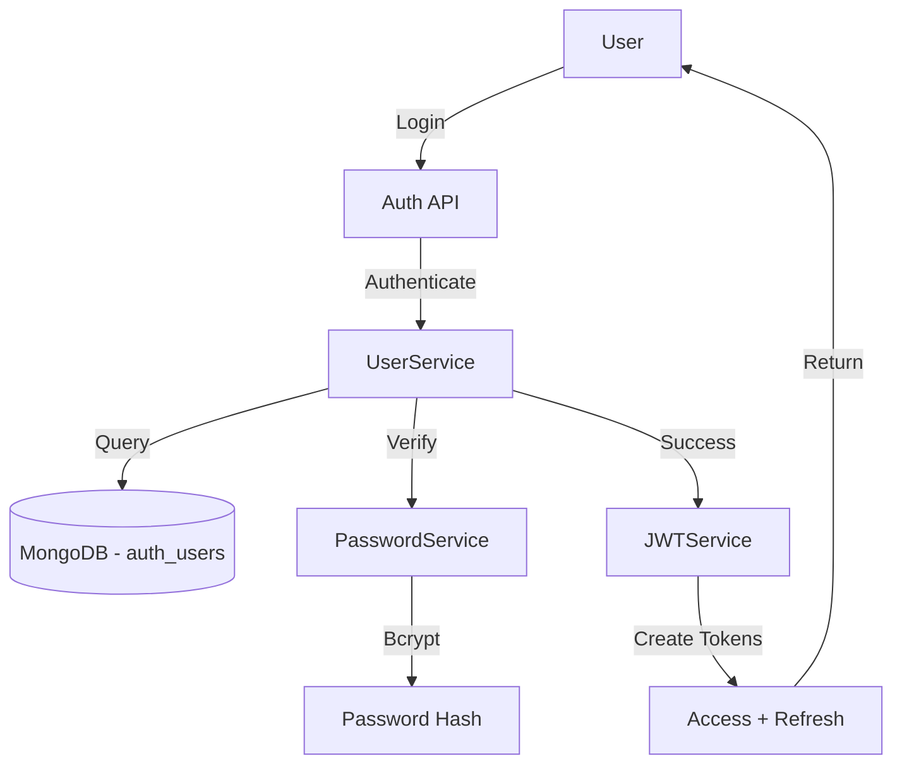

# Project Architecture: Content Template System

**Version:** 1.2 (Updated January 12, 2026)
**Scope:** Frontend Content Rendering Engine + Backend Authentication + Design System
**Last Updated:** January 12, 2026

## 1. High-Level Overview

The **Content Template System** is a platform design that allows content creators to build rich, interactive web pages using simple Markdown/YAML templates, without writing React code. It effectively acts as a "Headless CMS" where the filesystem is the database and Markdown files are the entries.

**Core Philosophy:** "Content is Data, Renderer is Code."

## 2. Architecture Pipeline

The system follows a strict unidirectional data flow:



### 2.1 File Layer (The "Database")
- Located in `/frontend/public/content/pages/` (**single content location**)
- **Format:** Markdown with strict YAML frontmatter.
- **Structure:** Hierarchical folders representing the navigation tree.
- **Key Files:**
    - `card-definition.md`: Defines a module ("Card") and its settings.
    - `agenda.md`: The landing page for a card.
    - `page-template.md`: Individual content pages.
- **Important:** Content served from `public/` directory; `/content/...` paths resolve to `frontend/public/content/...`

### 2.2 Parser Layer (The "Backend" Logic)
Located in `frontend/src/lib/template-parser/`.
- **`file-loader.ts`**: Fetches raw content (supports caching).
- **`yaml-utils.ts`**: Extracts and validates YAML using `gray-matter`.
- **`section-parser.ts`**: The core logic that maps raw YAML objects to strict TypeScript interfaces.
- **`navigation-builder.ts`**: Recursively builds the page tree, detecting circular references and orphans.

### 2.3 Type System (The Contract)
Located in `frontend/src/lib/template-types/`.
- **Strict Interfaces**: Every piece of data has a TypeScript interface.
- **`Section` Union Type**: A discriminated union of all 31 supported section types (e.g., `HeroSection | TextSection | ImageSection`).
- **Discriminated Unions**: Usage of `type: 'hero'` fields allows TS to narrow types automatically.

### 2.4 Rendering Layer (The View)
Located in `frontend/src/components/template-renderer/`.
- **`CardRenderer`**: The main orchestrator. Switches between `AgendaRenderer` and `PageRenderer` based on `currentPage` state.
- **`NavigationProvider`**: The central state engine. 
    - Integrates `useTemplateParser` for client-side fetching.
    - Uses `NavigationBuilder` to transform flat page maps into hierarchical trees.
    - Exposes `navigateToPage(id)`, `getPage(id)`, and `goBack()` to all child components.
- **`PageRenderer`**: Renders a specific `PageDefinition`, integrating `Breadcrumbs`, `PageTree` (sidebar), and the `SectionRenderer`.
- **`SectionRenderer`**: A registry-based switcher that maps `Section.type` to specific UI components (31+ types).

## 3. Key Technical Decisions & Implementation Notes

### ID Consistency
- **Standard**: Always use `id` for internal unique identifiers and `page_id` for navigation targets in Agenda/ClickActions.
- **Note**: The parser maps these during the normalization phase in `useTemplateParser.ts`.

### Prop Standardization
- **Content Sections**: Standardized on `heading` for main section titles (e.g., in `HeroSection`) to maintain strict compliance with `lib/template-types`. Avoid using `title` as a top-level prop for these sections.

### Navigation Hierarchy
- **Recursive**: Supports infinite nesting depth (tested up to 5 levels).
- **Cycle Detection**: `NavigationBuilder` detects circular parent references (A -> B -> A) and throws a `ParseError` during the loading phase.
- **Breadcrumbs**: Automatically generated by walking up the `parent` chain in the `NavigationHierarchy`.

## 4. Component Library
The system abstracts UI into reusable "Sections".
- **Content**: Hero, Text, Image, Video, Embed.
- **Navigation**: Clickable Cards, Feature Grids, Image Clickable.
- **Data**: Timelines, Comparison Tables, Key-Value Pairs.
- **Interaction**: Accordions, Expandable Sections, Expandable Cards, Interactive Diagrams (Hotspots).

## 5. Developer "Memory" (For Next Session)

> [!TIP]
> **To start work in the next session:**
> 1. **Check Types**: Always verify new section interfaces in `frontend/src/lib/template-types/`.
> 2. **Registry**: Register any new section in `frontend/src/components/template-renderer/SectionRenderer.tsx`.
> 3. **Validation**: Use `EndToEndCard.test.tsx` as the source of truth for integration stability.
> 4. **Mocking**: When unit testing sections, mock `useClickAction` or `usePopup` if they involve interactivity.
> 5. **Scrolling**: `NavigationProvider` includes a `window.scrollTo(0,0)` on every page change; remember to mock this in Vitest.

## 6. Authentication & Authorization System (NEW - Jan 2026)

### 6.1 Overview
The system now includes a comprehensive authentication layer for the visual editor and card management features.

### 6.2 Backend Authentication Architecture



### 6.3 Authentication Components

**Backend Services:**
- **Location**: `backend/app/services/`
- **Files**:
  - `auth_services.py` - Password hashing (bcrypt) & JWT token management
  - `user_service.py` - User CRUD, authentication, account lockout

**Models:**
- **Location**: `backend/app/models/auth_user.py`
- **AuthUser Model**:
  - Three roles: `guest`, `viewer`, `admin`
  - Password hash enforcement (bcrypt, 60 chars)
  - Account lockout after 5 failed attempts
  - Profile support (name, avatar, timezone)
  - Secure serialization (passwords excluded by default)

**API Endpoints:**
- **Location**: `backend/app/api/auth_cards.py`
- **Routes**:
  - `POST /api/v1/auth-cards/login` - Authenticate user
  - `POST /api/v1/auth-cards/logout` - Logout (client-side)
  - `POST /api/v1/auth-cards/refresh` - Refresh access token
  - `GET /api/v1/auth-cards/me` - Get current user

### 6.4 Database Schema

**Collection**: `auth_users` (Azure Cosmos DB - MongoDB API)

```javascript
{
  "_id": ObjectId,
  "user_id": "usr_...",
  "email": "user@example.com",
  "username": "User Name",
  "password_hash": "$2b$12$...", // Bcrypt hash
  "role": "admin" | "viewer" | "guest",

  "profile": {
    "first_name": "John",
    "last_name": "Doe",
    "avatar_url": null,
    "timezone": "UTC"
  },

  // Security
  "is_active": true,
  "email_verified": true,
  "failed_login_attempts": 0,
  "locked_until": null,

  // Timestamps
  "created_at": ISODate,
  "updated_at": ISODate,
  "last_login_at": ISODate
}
```

**Indexes:**
- `role` - Non-unique index for filtering
- `is_active` - Non-unique index for filtering
- `created_at` - Index for sorting
- Email/user_id uniqueness enforced by application logic

### 6.5 Security Features

**Password Security:**
- Bcrypt hashing (cost factor 12)
- Minimum 8 characters
- Complexity requirements (uppercase, lowercase, number, special char)
- Never stored or returned in plain text

**Token Security:**
- JWT with HS256 algorithm
- Access tokens: 15-minute expiry
- Refresh tokens: 30-day expiry
- Automatic expiration handling

**Account Protection:**
- Failed login tracking
- Automatic lockout after 5 attempts
- 30-minute lockout duration
- Last login timestamp tracking

### 6.6 Role-Based Access Control

| Role | Access Level | Capabilities |
|------|-------------|--------------|
| **guest** | Public | View published cards only |
| **viewer** | Authenticated | Configure demo card visibility |
| **admin** | Full | Edit cards, manage users, import/export |

### 6.7 Test Users

**Available in Database:**
```
Admin:  admin@example.com  / Admin  (full access)
Viewer: viewer@example.com / Viewer (demo configuration)
```

### 6.8 Integration Points

**Current:**
- Backend authentication fully implemented
- Database connected to centralized Azure Cosmos DB
- API endpoints available at `/api/v1/auth-cards/*`

**Pending:**
- Frontend AuthContext for global state
- Login form component
- Protected route component
- Visual editor access control

## 7. Design System & Visual Consistency

### 7.1 Unified Layout Specification

**Document:** `templates/UNIFIED_LAYOUT_SPECIFICATION.md`
**Version:** 1.1
**Status:** Complete and Ready for Implementation

The Unified Layout Specification defines consistent visual design across all component cards, establishing:
- **Brand Colors**: Temenos Navy (#003366), Temenos Blue (#0066CC), Temenos Cyan (#00A3E0)
- **Typography**: Inter font family with standardized type scale (H1-H5, body text variants)
- **Component Styling**: Buttons, tabs, cards, forms, badges, alerts
- **Spacing System**: 4px baseline grid with consistent spacing scale
- **Color System**: Extended palette with functional colors (success, warning, error, info)
- **Dark Mode**: Full dark mode support with proper contrast ratios
- **Accessibility**: WCAG 2.1 AA compliance

### 7.2 Design System Showcase

A comprehensive interactive prototype demonstrating all design patterns:
- **Location**: Design System Showcase card (accessible from homepage)
- **10 Interactive Pages**: Overview, Typography, Colors, Buttons, Cards, Forms, Navigation, Components, Spacing, Animations
- **Features**: Live examples, hover effects, dark/light mode switching, copy-paste ready code

### 7.3 Implementation Status

**Completed:**
- ✅ Unified Layout Specification document (54KB, 1,960 lines)
- ✅ Design System Showcase component with 10 comprehensive pages
- ✅ All component patterns documented with Tailwind classes
- ✅ Alert & notification patterns (Section 6.8)
- ✅ Gradient accent cards (Section 6.9)
- ✅ Multiple loading indicators (spinner, bouncing dots, progress bar)

**Pending:**
- Card-by-card application of unified layout specification
- Observability card updated with new design system
- Security card updated with new design system

### 7.4 Key Documentation Files

**Specification:**
- `templates/UNIFIED_LAYOUT_SPECIFICATION.md` - Complete design system specification
- `templates/spec/DESIGN_SYSTEM_SHOWCASE_README.md` - Showcase documentation
- `templates/spec/QUALITY_STANDARDS.md` - Mandatory styling standards

**Authentication Documentation:**
- `templates/spec/TASK_COMPLETE.md` - Authentication implementation completion summary
- `templates/spec/AUTHENTICATION_REFERENCE.md` - Quick reference for auth system
- `templates/spec/AUTHENTICATION_SETUP.md` - Setup guide
- `templates/spec/AUTHENTICATION_IMPLEMENTATION_SUMMARY.md` - Implementation summary

## 8. Security & Performance
- **Sanitization**: All Markdown content is sanitized.
- **Latency**: Navigation is optimized to <50ms by keeping the `pagesMap` in memory after the initial load.
- **Validation**: Strict schema validation ensures malformed YAML does not crash the UI.
- **Authentication**: JWT-based authentication with bcrypt password hashing (NEW).
- **Authorization**: Role-based access control for visual editor and card management (NEW).
