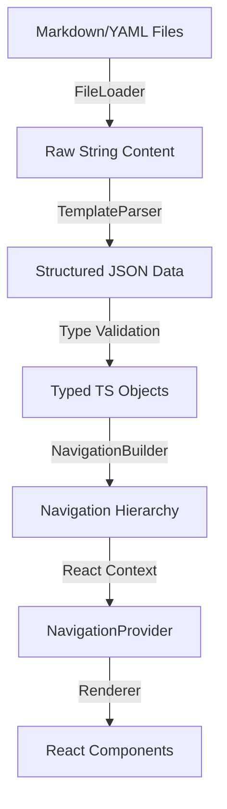

# Project Architecture: Content Template System

**Version:** 1.0 (Based on Phase 2 Specifications)
**Scope:** Frontend Content Rendering Engine

## 1. High-Level Overview

The **Content Template System** is a platform design that allows content creators to build rich, interactive web pages using simple Markdown/YAML templates, without writing React code. It effectively acts as a "Headless CMS" where the filesystem is the database and Markdown files are the entries.

**Core Philosophy:** "Content is Data, Renderer is Code."

## 2. Architecture Pipeline

The system follows a strict unidirectional data flow:

### 2.1 File Layer (The "Database")
- Located in `/content/pages/`
- **Format:** Markdown with strict YAML frontmatter.
- **Structure:** Hierarchical folders representing the navigation tree.
- **Key Files:**
    - `card-definition.md`: Defines a module ("Card") and its settings.
    - `agenda.md`: The landing page for a card.
    - `page-template.md`: Individual content pages.

### 2.2 Parser Layer (The "Backend" Logic)
Located in `frontend/src/lib/template-parser/`.
- **`file-loader.ts`**: Fetches raw content (supports caching).
- **`yaml-utils.ts`**: Extracts and validates YAML using `gray-matter`.
- **`section-parser.ts`**: The core logic that maps raw YAML objects to strict TypeScript interfaces.
- **`navigation-builder.ts`**: Recursively builds the page tree, detecting circular references and orphans.

### 2.3 Type System (The Contract)
Located in `frontend/src/lib/template-types/`.
- **Strict Interfaces**: Every piece of data has a TypeScript interface.
- **`Section` Union Type**: A discriminated union of all 31 supported section types (e.g., `HeroSection | TextSection | ImageSection`).
- **Discriminated Unions**: Usage of `type: 'hero'` fields allows TS to narrow types automatically.

### 2.4 Rendering Layer (The View)
Located in `frontend/src/components/template-renderer/`.
- **`TemplateRenderer`**: The main entry point. It decides which specific component to render based on the `type` field.
- **`NavigationProvider`**: A React Context that holds the "Global State" of the user's journey (current page, history, breadcrumbs).
- **Section Components**: 31+ dumb components (e.g., `HeroSection.tsx`, `FeatureGrid.tsx`) that take data as props and render UI.

## 3. Key Technical Decisions

### "Right the First Time" Principles
The architecture strictly enforces:
1.  **Test-Driven Development (TDD)**: No component is built without a failing test first.
2.  **Strict Typing**: `any` types are forbidden.
3.  **Runtime Validation**: Data from external files MUST be validated before use (Architecture plan mandates Zod, though current implementation differs).

### Navigation System
- **Recursive**: Supports infinite nesting depth (tested up to 5 levels).
- **Safety**: Includes cycle detection to prevent infinite loops (A -> B -> A).
- **Breadcrumbs**: Auto-generated based on the folder hierarchy.

## 4. Component Library
The system abstracts UI into reusable "Sections".
- **Content**: Hero, Text, Image, Video.
- **Navigation**: Clickable Cards, Tabs, Feature Grids.
- **Data**: Timelines, Comparison Tables, Key-Value Pairs.
- **Interaction**: Accordions, Popups, Modals.

## 5. Security Model
- **Sanitization**: All Markdown content is sanitized to prevent XSS.
- **Script Blocking**: Inline scripts are stripped.
- **Validation**: Malformed YAML is rejected at the parser level, preventing UI crashes.
